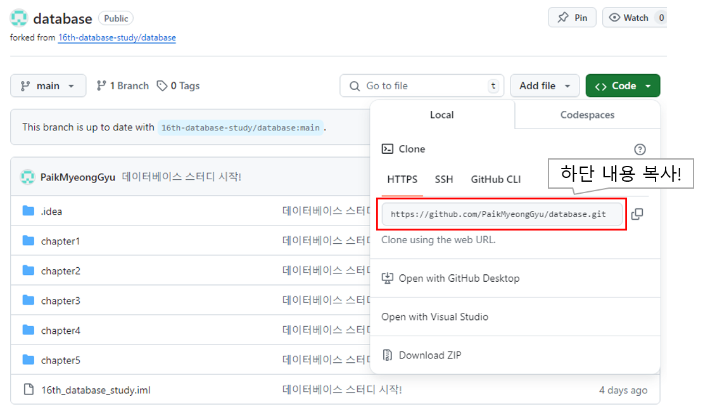

# 1. 파일 변경 관련 규칙
## 1.1 Github 내 프로젝트 클론



## 1.2 인텔리제이 IDE 접속 및 커맨드

main에 request 날리고 확인하면서 적용하기 힘들어서 dev라는 브랜치 따로 파서 사용할 것임.
개인적으로 작업할 브랜치 따로 파서 사용해도 괜찮음. 이후에 작업 완료되면 dev 브랜치에 병합했으면 함.
```shell
데이터 가져오기
> git clone [복사URL]
> git checkout -b dev
> git pull
글 작성 후
> git add -A
하단 커밋 메시지 규칙: [작성자] : 변경 챕터, 간단 이유
> git commit -m [커밋 메시지]
> git push origin
```