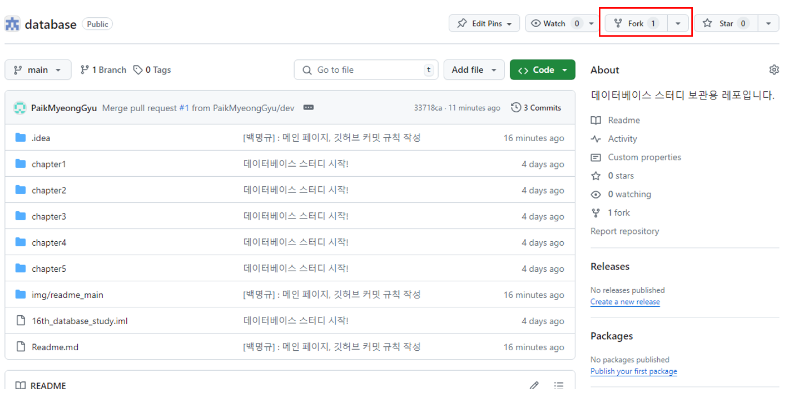
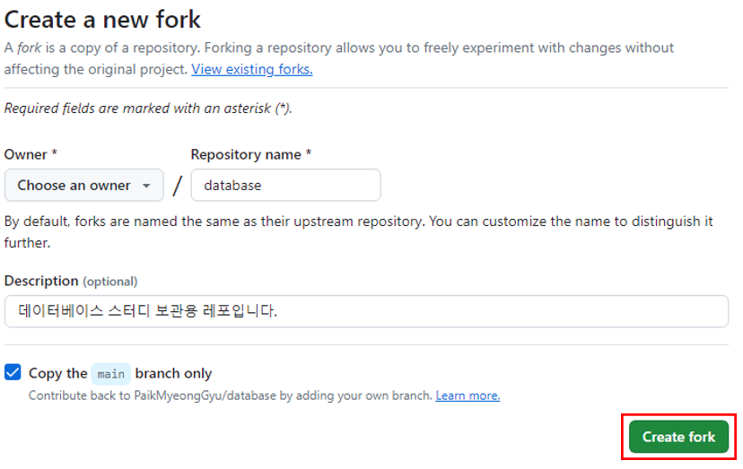
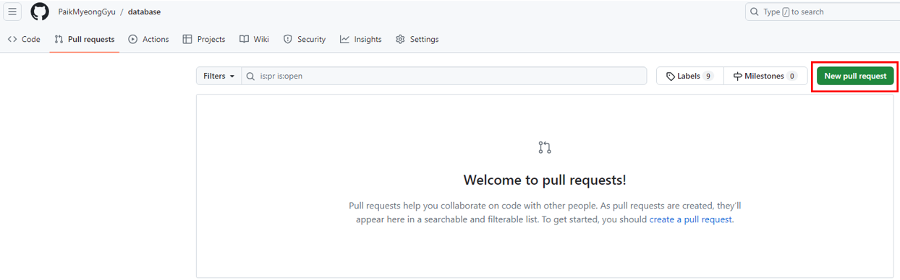
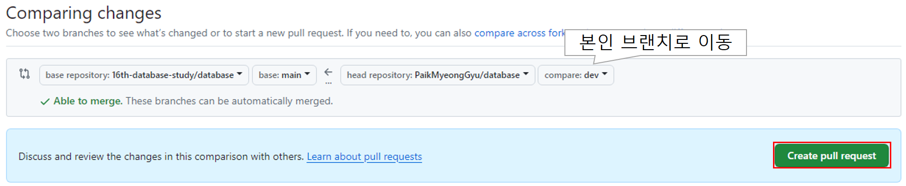

# 1. 활동 관련 규칙
## 1.1 매주 활동 내역
1. 매주 월요일 오후 6시-6시 30분까지 회의 시간으로 비울 것
2. 매주 토요일 자정까지 해당 주차 챕터 관련 학습 내용 업로드
3. 매주 일요일 아침에 사다리타기로 당첨된 1명, 업로드 내용 정리해오기(월요일 회의 시간에 이야기)
4. 세미나는 월요일날 혹은 MM으로 따로 공지하겠음.(스터디 세미나 패스 후 반 세미나로 이동 가능!)
5. 월요일 회의 당시 논의 거리를 토의 주제로 MM에 올릴테니 고민해보고 본인 결론 답글 달아주기

## 1.2 겹치는 챕터
1. 뒷 챕터에 겹치는 내용이 있는 경우에는 해당 챕터 작성자는 작성 요청 글 작성
2. 특정 챕터 내용을 뒷 사람이 정리해서 답글과 프로젝트 내 어디 폴더에 있는지 작성해줄 것

# 2. 파일 변경 관련 규칙
## 2.1 Github 내 프로젝트 클론

메인 프로젝트 fork!


fork 생성! Owner를 본인으로 놓고 생성하면 됨!


## 2.2 인텔리제이 IDE 접속 및 커맨드

따로 fork해서 dev나 뭐 아무 이름 브랜치 생성해서 PR 보내고 카톡 남기면 됨. 개인적으로 확인하고 PR 내용 보고 병합하겠음.
```shell
데이터 가져오기
> git clone [복사URL]
> git checkout -b dev
> git pull
글 작성 후
> git add -A
하단 커밋 메시지 규칙: [작성자] : 변경 챕터, 간단 이유
> git commit -m [커밋 메시지]
> git push origin
```

## 2.3 PR 날리기

1. 직접 깃허브에 본인 깃허브 디렉토리로 이동

2. Pull-requests로 이동, New pull request 이동



3. Pull request 생성, 주의 사항은 본인이 작성한 페이지로 이동해야 함.



4. request 날리면 카톡으로 *** PR 확인 요청 부탁 ***

## 2.4 폴더 관리 관련 규칙
폴더 구조는 초기 데이터베이스 스터디에서 정한 5개의 챕터로 분리를 함. 
폴더 내에는 question, source 폴더가 있음.

1. 각자 학습한 내역은 chapter 바로 아래에 "정리_내용(영문명).md" 형태로 저장
2. 정리 내용 이미지는 source 내의 image 폴더에 본인 이름으로 폴더 생성 후 저장
3. question.md에는 해당 챕터 담당자가 해당 챕터 관련 질문 내용 업로드