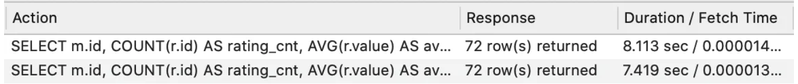

## DML (Data Manipulation Language)


### 정의

DML은 데이터베이스에 입력된 레코드를 조회, 수정, 삭제하는 등의 역할을 하는 언어를 지칭한다.


[이미지 출처] : [https://jinendra-singh.medium.com/sql-dml-commands-chapter-3-642dd073898b](https://jinendra-singh.medium.com/sql-dml-commands-chapter-3-642dd073898b)

DML은 사용자가 CRUD 를 통해 데이터베이스와 상호작용하여 데이터를 생성, 조회, 갱신, 삭제를 할 수 있도록 해준다. 이번 스터디에서는 일반적으로 서비스를 개발하게 되면 가장 많이 사용되는 Select에 대해서 자세히 알아보자.


## Select

Select는 DB로부터 데이터를 조회할 때 사용된다.

### 실행 순서

Select 쿼리는 FROM & JOIN, WHERE, GROUP BY, HAVING, SELECT, ORDER BY, LIMIT 순으로 실행된다. 이를 시각화하면 아래와 같다.


[이미지 출처] : [https://jaehoney.tistory.com/191](https://jaehoney.tistory.com/191)


### FROM + JOIN

SELECT 쿼리를 실행하게 되면 FROM 절이 가장 먼저 실행되고 조회할 테이블을 지정한다. 이후에 JOIN을 실행하여 하나의 가상 테이블로 결합한다.

### WHERE

WHERE 절은 조건에 맞는 데이터를 필터링한다.

### GROUP BY

GROUP BY 절에서는 선택한 컬럼을 기준으로 조회한 레코드를 그룹핑한다.

### HAVING

HAVING 절은 GROUP BY로 그룹핑한 데이터에 대해서 필터링을 수행한다. 

- **HAVING 절의 조건을 WHERE 절에 사용할 수 있다면 WHERE 절에서 처리하는 게 좋다.** HAVING 절은 각 그룹에 대해서 조건을 걸기 때문에 성능이 떨어진다.

### SELECT

SELECT 절은 HAVING 절까지 수행되고 걸러진 데이터에 대해서 어떤 컬럼을 출력할 지 선택한다.

### ORDER BY

ORDER 절은 선택된 데이터에 대해서 어떤 순서로 정렬할 지 결정하는 역할을 한다.

### LIMIT

LIMIT 절은 결과 중에서 몇개의 행을 보여줄 지 결정한다.


## SELECT 쿼리 튜닝

아래 쿼리는  [SELECT 쿼리 튜닝](https://medium.com/watcha/%EC%BF%BC%EB%A6%AC-%EC%B5%9C%EC%A0%81%ED%99%94-%EC%B2%AB%EA%B1%B8%EC%9D%8C-%EB%B3%B4%EB%8B%A4-%EB%B9%A0%EB%A5%B8-%EC%BF%BC%EB%A6%AC%EB%A5%BC-%EC%9C%84%ED%95%9C-7%EA%B0%80%EC%A7%80-%EC%B2%B4%ED%81%AC-%EB%A6%AC%EC%8A%A4%ED%8A%B8-bafec9d2c073) 에서 가져왔습니다.

#### - 예시 테이블

#### Movie Table

| Column Name | Data Type | Description |
| ----------- | --------- | ----------- |
| id          | int       | primary key |
| title       | varchar   | 영화 제목   |

#### Rating Table
| Column Name | Data Type | Description                 |
| ----------- | --------- | --------------------------- |
| id          | int       | primary key                 |
| movie_id    | int       | 별점의 대상이 되는 movie id |
| value       | int       | 별점의 값                   |

#### Genre Table
| Column Name | Data Type | Description                 |
| ----------- | --------- | --------------------------- |
| id          | int       | primary key                 |
| movie_id    | int       | 별점의 대상이 되는 movie id |
| genre       | varchar   | 장르명                      |


1. 필요한 컬럼만 호출하기

```SQL
-- Inefficient
SELECT * FROM PRODUCT;

-- Improved
SELECT id FROM PRODUCT;
```

불러오는 컬럼의 수가 많아질 수록 DB는 더 많은 데이터를 로드해야 한다.  가능하다면 필요한 컬럼만 조회하는 게 좋다.


2. 조건 절에서 DB 값에 별도의 연산 사용하지 않기

```SQL
-- Inefficient
SELECT m.id, ANY_VALUE(m.title) title, COUNT(r.id) r_count 
FROM movie m 
INNER JOIN rating r 
ON m.id = r.movie_id 
WHERE FLOOR(r.value/2) = 2 
GROUP BY m.id;
-- Improved
SELECT m.id, ANY_VALUE(m.title) title, COUNT(r.id) r_count 
FROM movie m 
INNER JOIN rating r 
ON m.id = r.movie_id 
WHERE r.value BETWEEN 4 AND 5 
GROUP BY m.id;
```

조건절에서 별도의 함수를 쓰는 것보다 안 쓰는게 성능이 더 좋다.


* 위의 쿼리의 경우 Table Full Scan을 하면서 모든 값을 탐색하고, 수식을 적용한 후 조건이 만족하는 지 판단한다. 
* 아래 쿼리의 경우 r.value가 가지고 있는 인덱스를 사용할 수 있기 때문에 모든 데이터를 탐색할 필요가 없다.

**Question) 왜 Table Full Scan이 일어날까?** 

-> 옵티마이저가 데이터의 분포를 보고 적절하게 쿼리를 최적화하는데 함수를 사용하게 되면 함수의 결과값을 옵티마지어가 예상할 수 없게 된다. 때문에 Table Full Scan이 발생한다. (이에 대해서는 나중에 옵티마이저 다루는 사람이 더 자세하게 해주면 좋을 것 같습니다.!)


3. LIKE 절의 와일드카드를 String의 앞 부분에 배치하지 않기

```SQL
-- Inefficient
SELECT       g.value genre, COUNT(r.movie_id) r_cnt
FROM         rating r
INNER JOIN   genre g
ON           r.movie_id = g.movie_id
WHERE        g.value LIKE "%Comedy"
GROUP BY     g.value;

-- Improved(1): value IN (...)
SELECT      g.value genre, COUNT(r.movie_id) r_cnt
FROM        rating r
INNER JOIN  genre g
ON          r.movie_id = g.movie_id
WHERE       g.value IN ("Romantic Comedy", "Comedy")
GROUP  BY   g.value;

-- Improved(2): value = "..."
SELECT      g.value genre, COUNT(r.movie_id) r_cnt
FROM        rating r
INNER JOIN  genre g
ON          r.movie_id = g.movie_id
WHERE       g.value = "Romantic Comedy" OR g.value = "Comedy"
GROUP BY    g.value;

-- Improved(3): value LIKE "...%"
-- 🌟 모든 문자열을 탐색할 필요가 없어, 가장 좋은 성능을 냄
SELECT      g.value genre, COUNT(r.movie_id) r_cnt
FROM        rating  r
INNER JOIN  genre  g
ON          r.movie_id = g.movie_id
WHERE       g.value LIKE "Romantic%" OR g.value LIKE "Comed%"
GROUP BY    g.value
```

여기서도 마찬가지로 "%Comedy" 는 Table Full Scan을 사용하고 나머지는 Index를 사용하여 스캔한다. 성능 비교는 아래와 같다.


**Quetsion) LIKE를 사용할 때 "...%"를 쓰면 항상 Index를 사용하여 스캔할까?** 

NO, 데이터의 비율을 따져서 ...으로 시작하는 데이터가 일정 비율 이상이면 Table Full Scan으로 동작한다. (대략 20% 이상이면 Full Scan)

-> 나중에 Table Full Scan, Index Range Scan 정리하는 분이 자세히 다뤄주시면 좋을 것 같네요!


4. 같은 내용의 조건이라면, GROUP BY 연산 시에는 가급적 HAVING보다는 WHERE 절을 사용하는 것이 좋다.

```SQL
-- Inefficient
SELECT m.id, COUNT(r.id) AS rating_cnt, AVG(r.value) AS avg_rating 
FROM movie m  
INNER JOIN rating r 
ON m.id = r.movie_id 
GROUP BY id 
HAVING m.id > 1000;
-- Improved
SELECT m.id, COUNT(r.id) AS rating_cnt, AVG(r.value) AS avg_rating 
FROM movie m  
INNER JOIN rating r 
ON m.id = r.movie_id 
WHERE m.id > 1000
GROUP BY id ;
```

쿼리 실행 순서가 WHERE 절이 먼저이기 때문에 미리 테이블의 크기를 작게 만들어서 GROUP BY에서 다뤄야 하는 데이터의 크기를 줄일 수 있다.




5. 3개 이상의 테이블을 INNER JOIN 할 때는, 크기가 가장 큰 테이블을 FROM 절에 배치하고, INNER JOIN 절에는 남은 테이블을 작은 순서대로 배치하는 것이 좋다.

```SQL
-- Query (A)
SELECT m.title, r.value rating, g.value genre 
FROM rating r 
INNER JOIN genre g 
ON g.movie_id = r.movie_id  
INNER JOIN movie m 
ON m.id = r.movie_id;
-- Query (B)
SELECT m.title, r.value rating, g.value genre 
FROM rating r 
INNER JOIN movie m
ON r.movie_id = m.id 
INNER JOIN genre g 
ON r.movie_id = g.movie_id;
```

하지만 위의 최적화는 항상 통용되지는 않는다. 간단한 INNER JOIN의 경우 Query Planner 가 가장 효율적인 순서를 탐색해서 INNER JOIN의 순서를 바꾼다. A, B 쿼리의 경우 실행 시간의 차이가 없다.


테이블의 개수가 늘어나면 INNER JOIN 순서의 경우의 수가 많아질 것이다. 그리고 이는 Planining 비용의 증가로 이어진다. 결국 어느 임계점을 넘으면 Planning 비용을 지불하고 가장 최적의 쿼리를 찾는 것보다 차선의 INNER JOIN 순서로 쿼리를 실행시켜 Planning 비용을 줄이는 게 더 효율적일 수 있다. 따라서 작성할 때 INNER JOIN의 순서를 잘 정해서 세팅해두는 게 도움이 될 수 있다.


7. 자주 사용하는 데이터의 형식에 대해서는 미리 전처리된 테이블을 따로 보관/관리하는 것도 좋다.

이전에 설명했던 통계를 위한 반정규화이다. RDBMS의 원칙에 어긋나는 측면이 있고, DB의 실시간성을 반영하지 못할 가능성이 높기 때문에, 대부분 운영계보다는 분석계에서 더 많이 사용된다고 한다.

ex) 사용자에 의해 발생한 Log 데이터 중에서 필요한 Event만 모아서 따로 적재해두는 것, 혹은 핵심 서비스 지표를 주기적으로 계산해서 따로 모아두는 것 등이 가장 대표적으로 볼 수 있는 사례이다.


## 묵시적 형변환

묵시적 형변환은 조건절의 데이터 타입이 다를 때, 우선순위가 높은 타입으로 내부적으로 형이 변환되는 것을 말한다. **정수 타입이 문자열 타입보다 우선순위가 높다.** 때문에 만약 문자열과 정수 타입을 비교하는 쿼리가 있다면 우선순위가 낮은 문자열이 정수 타입으로 변환된다.

이 때, 묵시적 형변환이 발생하는 대상이 인덱스 필드라면 조건절을 처리하기 위해 모든 칼럼의 데이터를 묵시적으로 변환하기 떄문에 인덱스를 사용하지 못하고 Table Full Scan이 일어난다.

### 예시

```SQL
# 정수 컬럼을 문자열과 비교한 경우
SELECT * FROM test WHERE integer_field = '2250300062';
```

이 경우는 Integer가 우선순위가 높기 때문에 '2250300062' 가 정수로 형변환되고 정상적으로 인덱스를 탈 수 있다.

```SQL
SELECT * FROM test WHERE character_field = 34578451129965;
```

이 경우는 문자열 타입인 character_field보다 Integer 타입인 34578451129965 가 더 우선순위가 높기 때문에 묵시적으로 character_field의 모든 컬럼이 정수로 형변환된다. 이를 위해 Table Full Scan이 발생한다.


### 참고자료

* [https://medium.com/watcha/%EC%BF%BC%EB%A6%AC-%EC%B5%9C%EC%A0%81%ED%99%94-%EC%B2%AB%EA%B1%B8%EC%9D%8C-%EB%B3%B4%EB%8B%A4-%EB%B9%A0%EB%A5%B8-%EC%BF%BC%EB%A6%AC%EB%A5%BC-%EC%9C%84%ED%95%9C-7%EA%B0%80%EC%A7%80-%EC%B2%B4%ED%81%AC-%EB%A6%AC%EC%8A%A4%ED%8A%B8-bafec9d2c073](https://medium.com/watcha/%EC%BF%BC%EB%A6%AC-%EC%B5%9C%EC%A0%81%ED%99%94-%EC%B2%AB%EA%B1%B8%EC%9D%8C-%EB%B3%B4%EB%8B%A4-%EB%B9%A0%EB%A5%B8-%EC%BF%BC%EB%A6%AC%EB%A5%BC-%EC%9C%84%ED%95%9C-7%EA%B0%80%EC%A7%80-%EC%B2%B4%ED%81%AC-%EB%A6%AC%EC%8A%A4%ED%8A%B8-bafec9d2c073)

* [https://jaehoney.tistory.com/191](https://jaehoney.tistory.com/191)

* [https://nomadlee.com/mysql-%ED%9A%A8%EC%9C%A8%EC%A0%81%EC%9D%B8-sql-%EC%9E%91%EC%84%B1-3%EA%B0%80%EC%A7%80-%EB%B0%A9%EB%B2%95/](https://nomadlee.com/mysql-%ED%9A%A8%EC%9C%A8%EC%A0%81%EC%9D%B8-sql-%EC%9E%91%EC%84%B1-3%EA%B0%80%EC%A7%80-%EB%B0%A9%EB%B2%95/)

* [https://hodduc.tistory.com/20](https://hodduc.tistory.com/20)
