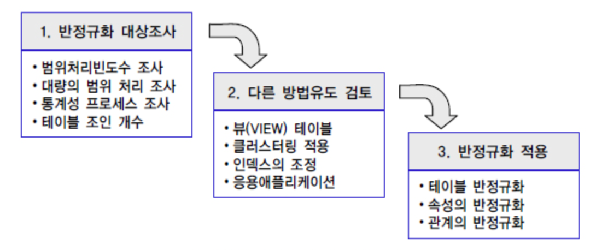

## 이상현상 (Anomaly)

| 학번 | 이름   | 나이 | 성별 | 강의코드 | 강의명            | 전화번호      |
| ---- | ------ | ---- | ---- | -------- | ----------------- | ------------- |
| 1011 | 백명규 | 27   | 남   | DB1      | 데이터베이스 개론 | 010-0000-0000 |
| 1012 | 엄예림 | 26   | 여   | OS1      | 운영체제          | 010-1111-1111 |
| 1013 | 김지민 | 25   | 여   | DS1      | 자료구조          | 010-2222-2222 |
| 1013 | 강진주 | 25   | 여   | WP1      | 웹 프로그래밍     | 010-3333-3333 |
| 1014 | 문진수 | 27   | 남   | EP1      | 임베디드          | 010-4444-4444 |
| 1014 | 문진수 | 27   | 남   | NW1      | 네트워크          | 010-5555-5555 |
| 1015 | 김수현 | 27   | 남   | NULL     | NULL              | 010-6666-6666 |

* 삽입 이상 (Insertion Anomaly) : 데이터를 삽입할 때, 의도하지 않은 데이터를 함께 삽입해야지만 데이터를 테이블에 추가할 수 있는 현상

아직 수강신청을 하지 않은 김수현 학생의 데이터를 삽입하려면 강의코드, 강의명에 NULL 값을 입력해야 한다.

* 갱신 이상 (Modification Anomaly) : 중복된 데이터 중 일부만 수정되어 데이터의 모순이 발생하는 현상

문진수 학생의 전화번호를 010-4444-4444 -> 010-5555-5555로 수정했는데 2개의 튜플 중에 하나의 튜플만 갱신되어 데이터의 모순이 발생할 수 있다.

* 삭제 이상 (Deletion Anomaly) : 어떤 데이터를 삭제할 때 의도하지 않은 데이터까지 같이 삭제되는 현상

강진주 학생의 데이터를 삭제하면 웹 프로그래밍 과목과 관련된 데이터도 삭제된다.

한 개의 릴레이션에 두 개 이상의 속성이 포함되어 있고 기본키가 아닌 속성이 결정자일 때 발생

-> **즉 같은 데이터가 중복되서 여러 테이블에 저장됐을 때, 발생하게 된다.**

## 함수 종속성 (Functional Dependency)

* 어떤 속성 A의 값을 알면 또 다른 속성 B의 값이 유일하게 정해지는 관계를 종속성이라고 한다.
* A -> B 로 표기되며 A를 **결정자**, B를 **종속자**라고 한다.

예시로 이해해보자.

| 학생번호 | 학생이름 | 주소            | 학과     | 학과사무실 | 강좌이름     | 강의실 | 성적 |
| -------- | -------- | --------------- | -------- | ---------- | ------------ | ------ | ---- |
| 501      | 백명규   | 영국 맨체스터   | 컴퓨터과 | G101       | 데이터베이스 | G 110  | 3.5  |
| 401      | 김지민   | 대한민국 서울   | 컴퓨터과 | G101       | 데이터베이스 | G 110  | 4.0  |
| 402      | 강진주   | 대한민국 강원도 | 경역학과 | F101       | 회계원리     | F 101  | 3.5  |
| 502      | 엄예림   | 미국 클리블랜드 | 경제학과 | F101       | 미시경제학   | F 101  | 4.0  |
| 501      | 문진수   | 영국 맨체스터   | 체육학과 | K101       | 스포츠경영학 | K 101  | 3.5  |

위 테이블에서 학생 번호를 알면 학생 이름, 주소, 학과를 알 수 있고 강좌 이름을 알면 강의실이 어딘지 알 수 있다. 이렇듯 하나의 속성(A)에 따라 또 다른 속성(B)이 유일하게 정해지는 의존관계를 속성 B가 속성 A에 종속된다고 표현한다. (또는 속성 A는 속성 B를 결정한다.)

## 함수 종석성 다이어그램

* 릴레이션 : 직사각형
* 속성 간의 함수 종속성 : 화살표
* 복합 속성 : 직사각형으로 묶어서 표현

[위 테이블의 함수적 종속 관계를 다이어그램으로 표현]

정규화 과정을 거쳐서 테이블을 분해하면 위와 같은 다이어그램을 도출할 수 있다. 이제부터 1, 2, 3 정규화 각각에 대해서 알아보자.

## 정규화 (Normalization) 

정규화란 이상 현상이 발생하는 릴레이션을 분해하여 이상현상을 없애는 과정을 말한다. 따라서 정규화의 목표는 테이블 간의 중복된 데이터를 허용하지 않는 것이다. 이를 통해서 무결성을 유지할 수 있고, DB 저장 용량도 줄일 수 있다.

이제 각 과정에 대해서 살펴보자.

### [제1 정규화]

정의 : 제1 정규화는 테이블의 컬럼이 원자값을 갖도록 테이블을 분해하는 것이다. 

| 이름   | 역할              |
| ------ | ----------------- |
| 백명규 | 맛집 부장         |
| 엄예림 | 런치봇, 간식 부장 |
| 김지민 | 동물농장주인      |
| 강진주 | 화력 부장         |
| 문진수 | 출퇴근 알리미     |

엄예림 학생의 역할 속성을 보면 런치봇, 간식 부장 두 속성을 가지고 있는 것을 볼 수 있다.

이를 제1 정규화를 진행하여 분해하면 아래와 같은 테이블이 된다.

| 이름   | 역할          |
| ------ | ------------- |
| 백명규 | 맛집 부장     |
| 엄예림 | 런치봇        |
| 엄예림 | 간식 부장     |
| 김지민 | 동물농장주인  |
| 강진주 | 화력 부장     |
| 문진수 | 출퇴근 알리미 |

(속성 값이 **원자값**을 가지도록 분해)

### [제2 정규화]

제2 정규화란 제1 정규화를 진행한 테이블에 대해서 **완전 함수 종속**을 만족하도록 테이블을 분해하는 것을 말한다.

* 완전 함수 종속 : 기본키의 부분집합이 결정자가 되어선 안되는 것을 의미한다.

| 학생번호 | 강좌이름     | 강의실 | 성적 |
| -------- | ------------ | ------ | ---- |
| 1011     | 운영체제     | 604호  | A+   |
| 1012     | 데이터베이스 | 605호  | A+   |
| 1013     | 데이터베이스 | 605호  | B+   |
| 1014     | 알고리즘     | 603호  | B0   |
| 1015     | 알고리즘     | 603호  | C+   |

여기서 기본키는 (학생번호, 강좌이름) 으로 복합키라고 가정하자. 성적 컬럼은 (학생번호, 강좌이름)에 의해서 결정된다. 즉 (학생번호, 강좌이름) -> 성적 을 만족한다. 그런데 강의실의 경우는 어떠한가?

강의실은 기본키의 일부분인 강좌 이름만으로 결정된다. 즉 기본키의 부분키인 강좌이름이 결정자이다. 이는 완전 함수 종속을 만족시키지 못한다. 

**-> (학생 번호, 강좌이름) 으로 강의실이 결정돼야 하는데 기본키의 일부인 강좌 이름으로 강의실이 결정된다.**

이를 해결하기 위해 테이블에서 강의실을 분해하여 제2 정규형을 만족시키도록 변형시켜보자.

| 학생번호 | 강좌이름     | 성적 |
| -------- | ------------ | ---- |
| 1011     | 운영체제     | A+   |
| 1012     | 데이터베이스 | A+   |
| 1013     | 데이터베이스 | B+   |
| 1014     | 알고리즘     | B0   |
| 1015     | 알고리즘     | C+   |

| 강좌이름     | 강의실 |
| ------------ | ------ |
| 데이터베이스 | 605호  |
| 알고리즘     | 603호  |
| 운영체제     | 604호  |

### [제3 정규화]

제3 정규화는 제2 정규화를 진행한 테이블에 대해 **이행적 종속**을 제거하기 위해서 테이블을 분해하는 것을 말한다.

* 이행적 종속 : A->B, B->C가 성립할 때, A->C가 성립한다.

| 학생번호 | 강좌이름     | 수강료 |
| -------- | ------------ | ------ |
| 1011     | 운영체제     | 1000   |
| 1012     | 데이터베이스 | 1500   |
| 1013     | 데이터베이스 | 1500   |
| 1014     | 알고리즘     | 1200   |

학생번호가 기본키이고 학생번호에 대해서 강좌이름이 결정된다. 그리고 강좌이름에 따라 수강료가 결정된다고 가정하자.

그러면 학생번호 -> 강좌이름, 강좌이름 -> 수강료가 성립하고 학생번호 -> 수강료가 성립하게 된다. 때문에 이행적 종속이 성립한다.

**즉 기본키가 아닌 컬럼에 다른 컬럼이 종속되면 이행적 종속이 발생한다.**

왜 이행적 종속이 문제일까?

* 1011의 강좌를 알고리즘으로 바꾸게 되면 1011은 알고리즘을 1000원에 듣게 된다. 이를 막기 위해서는 강좌이름을 수정할 때 수강료도 함께 수정해야 된다. 이게 문제다.

이제 제3 정규화 과정을 통해 이행적 종속을 제거해보자.

| 학생번호 | 강좌이름     |
| -------- | ------------ |
| 1011     | 운영체제     |
| 1012     | 데이터베이스 |
| 1013     | 데이터베이스 |
| 1014     | 알고리즘     |

| 강좌이름     | 수강료 |
| ------------ | ------ |
| 데이터베이스 | 1500   |
| 운영체제     | 1000   |
| 알고리즘     | 1200   |

### [BCNF 정규화]

BCNF 정규화는 제3 정규화를 진행한 테이블에 대해서 모든 결정자가 후보키가 되도록 테이블을 분해하는 것을 말한다. 

| 학생번호 | 특강이름 | 교수   |
| -------- | -------- | ------ |
| 1011     | Java     | 가교수 |
| 1012     | Java     | 가교수 |
| 1013     | Vue      | 나교수 |
| 1014     | Spring   | 다교수 |
| 1015     | Spring   | 라교수 |

여기서 (학생번호, 특강이름)을 기본키라고 가정하자. 그리고 기본키는 교수를 결정하고 있다. 그런데 여기서 교수 또한 특강이름을 결정하는 결정자이다. 만약 가교수의 Java 수업을 듣는 학생이 늘어나게 된다면 동일한 (가교수, Java) 가 중복되서 저장될 것이다. 이는 추후에 가교수의 수업을 Java에서 다른 것으로 바꿀 때 중복된 모든 레코드를 수정해야 하는 것을 의미한다.

* 처음 정리할 때 해깔렸던 부분 : 3, BCNF 정규화의 차이는 그럼 뭐지? 

**=> 위 테이블의 기본키는 (학생번호, 특강이름) 이기 때문에 이행적 종속은 존재하지 않는다. 하지만 후보키가 아닌 교수가 특강 이름의 결정자이기 때문에 BCNF를 만족하지 않는다.**

BCNF 정규화를 통해서 이러한 중복 저장을 해결할 수 있다. 아래는 BCNF 정규화 결과를 보여준다.

| 학생번호 | 교수   |
| -------- | ------ |
| 1011     | 가교수 |
| 1012     | 가교수 |
| 1013     | 나교수 |
| 1014     | 다교수 |
| 1015     | 라교수 |

| 교수   | 특강이름 |
| ------ | -------- |
| 가교수 | Java     |
| 나교수 | Vue      |
| 다교수 | Spring   |
| 라교수 | Spring   |

### 항상 정규화가 옳은가?

정규화는 기본적으로 테이블 간의 중복된 데이터를 없애고 데이터베이스의 무결성을 유지하는 것을 목적으로 수행한다.

데이터가 중복 저장되지 않기 때문에 무결성을 지킬 수 있고 저장 용량을 줄일 수 있다.

그렇다면 항상 모든 데이터를 정규화하는 것이 정답일까?  NO

정규화를 하게 되면 데이터가 여러 테이블에 분산되어 저장되기 때문에 값을 조회할 때 조인이 많이 발생하여 성능 저하로 이어질 수 있다. 이뿐만 아니라 다양한 이유로 실무에서는 모든 데이터를 정규화하기 보다는 일부 데이터를 반정규화하여 관리한다.

## 반정규화 (De - Normalization)

반정규화를 정의하면 정규화된 엔터티, 속성, 관계에 대해 시스템의 성능향상과 개발(Development)과 운영(Maintenance)의 단순화를 위해 중복, 통합, 분리 등을 수행하는 데이터 모델링의 기법을 의미한다.

### 언제 수행하는가?

* 데이터를 조회할 때, 디스크 I/O가 많아서 성능 저하가 발생할 때.
* 경로가 너무 멀어서 조인으로 인한 성능 저하가 예상될 때.
* 컬럼을 계산하여 읽을 때, 성능 저하가 예상될 때.

### 주의사항

* 조회 속도는 빨라질 수 있지만 데이터 모델의 유연성이 떨어지고 정합성 이슈가 발생할 수 있다
* 여러 테이블에 걸쳐서 중복된 데이터가 저장될 수 있기 때문에 읽기를 제외한 연산의 복잡도가 올라간다.

### 반정규화 도입 절차

반정규화는 데이터의 중복이 발생하고 무결성 문제가 발생할 수 있기 때문에 다른 방법으로 개선할 수 있는지 먼저 찾아본 후에 도입하는 것이 좋다.

### 중복 컬럼 / 테이블 사전 조인 방식 (redundant column/Pre-joining tables)

**중복된 컬럼을 추가해서 데이터 조회 성능을 향상시키는 방법이다.**

고객의 주문 내역을 고객의 이름과 함께 보여줘야 하는 경우 Order오 Customer를 조인해서 데이터를 읽어야 한다. 고객의 이름을 비정규화해서 Order의 컬럼에 추가하게 되면 조인을 안하고도 조회가 가능해진다.

Customer - Order 는 1:N 관계이기 때문에 Order의 수만큼 고객 이름의 중복이 발생할 것이다. 만약 고객의 이름이 바뀐다면? 해당하는 모든 Order 테이블에 가서 고객의 이름을 바꿔야 정합성을 유지할 수 있다.

**조인 성능 <-> 정합성 유지** 사이의 균형을 잘 잡아야 한다.

### 수평 테이블 분할 (Horizontal table splitting)

 

**테이블을 행 단위로 분할하는 방식이다.**

위 예시에서 특정 학과의 학생을 조회할 때, 모든 행을 스캔해야 한다. 하지만 테이블을 학과별로 수평 분할하게 되면 특정 학과의 데이터만 보기 때문에 빠른 속도로 조회가 가능해진다.

### 수직 테이블 분할 (Vertical table splitting)

**테이블을 컬럼을 기준으로 분할하는 방식이다.**

일반적으로 테이블의 모든 컬럼이 동일한 빈도로 조회되고 갱신되지 않는다. 

빈번하게 조회되는 컬럼들을 별도의 테이블로 분할할 수도 있고 갱신이 많이 발생하는 컬럼도 별도의 테이블로 분할할 수 있다. 이를 통해서 불필요한 데이터에 대한 조회를 줄일 수 있다.

### 파생 열 추가 (Adding derived columns)

**통계 정보나 계산해서 제공해야 하는 데이터를 미리 컬럼에 저장해두는 방식이다.**

학생 정보, 학생 성적이라는 테이블이 있고, 애플리케이션에서 학생의 총점과 학생 정보를 같이 보여줘야 하는 요구사항이 있다고 가정하자.

매번 각 트랜잭션에서 학생의 점수 총합을 계산하는 대신에 미리 총점을 계산해서 컬럼에 삽입함으로써 성능을 향상시킬 수 있다.

이 외에도 다양한 반정규화 방법이 있습니다. 이 부분은 여러분에게 맡기겠습니다 :)

### 참고 자료

* [https://mangkyu.tistory.com/28](https://mangkyu.tistory.com/28)

* [https://mangkyu.tistory.com/110](https://mangkyu.tistory.com/110)

* [https://www.splunk.com/en_us/blog/learn/data-denormalization.html](https://www.splunk.com/en_us/blog/learn/data-denormalization.html)

* [https://en.wikipedia.org/wiki/Denormalization](https://en.wikipedia.org/wiki/Denormalization)

