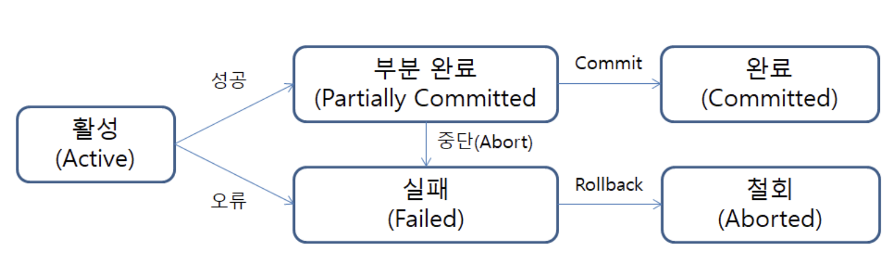
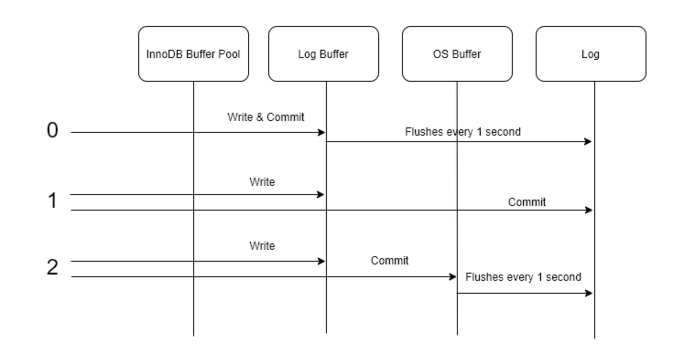

## TCL (Transaction Control Language)


## 정의

데이터를 제어하는 언어가 아닌 트랜잭션을 제어할때 사용한다. 논리적인 작업 단위를 묶어 DML에 의해 조작된 결과를 트랜잭션 별로 제어한다.


### 명령어

* COMMIT

COMMIT은 모든 작업들을 정상 처리하겠다고 확정하는 명령어이다. 해당 처리 과정을 DB에 영구 저장하겠다는 의미로 Commit을 수행하면 하나의 트랜잭션 과정이 종료된다.

* ROLLBACK

ROLLBACK은 트랜잭션으로 처리한 하나의 묶음 과정을 일어나기 전으로 돌리는 일이다. 


## 트랜잭션이란?

트랜잭션은 하나의 논리적인 작업 셋에 하나의 쿼리가 있든 두 개 이상의 쿼리가 있든 관계없이 논리적인 작업 셋 자체가 100% 적용되거나 (COMMIT)  아무것도 적용되지 않아야 (ROLLBACK) 함을 보장해주는 것을 의미한다. 


### ACID

- **원자성(Atomicity)** - 트랜잭션에 속한 각각의 문(데이터를 읽기, 쓰기, 업데이트 또는 삭제하기 위함)을 하나의 단위로 취급한다. 문 전체를 실행하거나 그 문의 어떤 부분도 실행하지 않거나 둘 중 하나이다. 이 속성이 있으면 예컨대 스트리밍 데이터 소스가 스트리밍 중에 갑자기 오류를 일으키더라도 데이터 손실과 손상이 방지된다.
- **일관성(Consistency)** - 트랜잭션이 테이블에 변경 사항을 적용할 때 미리 정의된, 예측할 수 있는 방식만 취합니다. 트랜잭션 일관성이 확보되면 데이터 손상이나 오류 때문에 테이블 무결성에 의도치 않은 결과가 생기지 않는다.
- **격리(Isolation)** - 여러 사용자가 같은 테이블에서 모두 동시에 읽고 쓰기 작업을 할 때, 각각의 트랜잭션을 격리하면 동시 트랜잭션이 서로 방해하거나 영향을 미치지 않는다. 각각의 요청이 실제로는 모두 동시에 발생하더라도, 마치 하나씩 발생하는 것처럼 발생할 수 있다.
- **영속성(Durability)** - 트랜잭션 실행으로 인해 데이터에 적용된 변경 사항이 저장되도록 보장한다. 

(격리 수준과 락은 뒤에 맡으신 분이 있기 때문에 여기서 정리하지 않고 넘어가겠습니다.)


### 원자성 (Atomicity)

간단한게 원자성의 중요성에 대해서 알 수 있는 예시를 가져왔다. (Real MySQL 참조, 156p~157p)

MYSQL 기준으로 InnoDB (트랜잭션 제공), MyISAM (트랜잭션 제공 X) 테이블에서 각각 Insert 쿼리를 실행하는 상황을 가정하자.

### MyISAM

```SQL
SET AUTOCOMMIT = TRUE; # Default가 TRUE이다.
INSERT INTO tab_myisam (fdpk) VALUES (3);
INSERT INTO tab_myisam (fdpk) VALUES (1), (2), (3); # '3' 중복 실패

ERROR 1062 (23000): Duplicate entry '3' for key 'PRIMARY'
```

트랜잭션을 제공하지 않는 MyISAM의 경우 쿼리에 실패했을 때, 아래와 같은 상태가 된다.

| fdpk |
| ---- |
| 1    |
| 2    |
| 3    |

`INSERT INTO tab_myisam (fdpk) VALUES (1), (2), (3);` 이 부분에서 분명 쿼리에 실패했는데 데이터가 삽입되어 있다. 

이러한 현상을 Partial Update라고 한다.

### InnoDB

```SQL
SET AUTOCOMMIT = TRUE; # Default가 TRUE이다.
INSERT INTO tab_innodb (fdpk) VALUES (3);
INSERT INTO tab_innodb (fdpk) VALUES (1), (2), (3); # '3' 중복 실패

ERROR 1062 (23000): Duplicate entry '3' for key 'PRIMARY'
```

트랜잭션을 제공하는 InnoDB의 경우 쿼리에 실패했을 때 모든 트랜잭션 내의 연산이 롤백된다.

| fdpk |
| ---- |


### 일관성(Consistency)

일관성은 어떻게 보장될 수 있을까? 트랜잭션이 진행되는 동안에 만약 DB의 데이터가 변경되면 어떻게 처리되어야 할까?

답은 **처음 트랜잭션을 시작할 때 참초한 데이터를 기반으로 트랜잭션을 진행**하는 것이다. 중간에 다른 TX에서 값을 변경하더라도 현재 TX는 처음 읽은 시점의 데이터를 기준으로 처리를 한다.

이를 통해서 각 사용자가 일관성 있는 데이터를 볼 수 있다.

-> 이 부분은 격리 수준과 밀접하게 연관이 있습니다. 마찬가지로 뒤의 챕터에서 다루기 때문에 여기서는 자세하게는 다루지 않겠습니다.


### 트랜잭션 주의사항

트랜잭션은 가능한 범위를 최소화하는 것이 좋다. 일반적으로 데이터베이스 커넥션의 수는 제한적이기 때문에 각 단위의 프로그램이 커넥션을 소유하는 시간이 길어질수록 사용 가능한 여유 커넥션의 수가 줄어든다. 

**특히 네트워크 작업이 있는 경우에 반드시 트랜잭션 외부로 빼는 것이 좋다.!**


### 트랜잭션 상태



Activce, Failed, Commited, Aborted는 문자 그대로의 의미이다. 여기서는 **Partially Committed** 에 대해서만 설명하고 넘어가겠다.

(자세한 설명은 [트랜잭션 개념 & 사용 정리](https://inpa.tistory.com/entry/MYSQL-%F0%9F%93%9A-%ED%8A%B8%EB%9E%9C%EC%9E%AD%EC%85%98Transaction-%EC%9D%B4%EB%9E%80-%F0%9F%92%AF-%EC%A0%95%EB%A6%AC#%ED%8A%B8%EB%9E%9C%EC%9E%AD%EC%85%98_%EB%AC%B8%EB%B2%95)) 를 참고하자.

Partially Committed는 트랜잭션이 끝까지 실행됐지만 아직 Commit이 실행되지 않은 상태를 의미한다. 설계된 작업이 완료되더라도 무조건 바로 DB에 반영하는 것이 아니라 최종 승인 (Commit)이 실행돼야만 정상적으로 DB에 반영되고 트랜잭션이 종료된다.


## 트랜잭션의 종류

### 묵시적 트랜잭션  (Implicit Transaction)

묵시적 트랜잭션은 레코드 단위에 기반해서 트랜잭션이 시작되고 끝나는 것을 말한다. 

```SQL
UPDATE employee SET position = 'CEO' WHERE name = '엄예림';
```

위와 같은 DML이 있을 때, 자동으로 시스템이 아래와 같이 구문을 붙여준다.

````SQL
START TRANSACTION;
UPDATE employee SET position = 'CEO' WHERE name = '엄예림';
COMMIT;
````

(MySQL의 경우 기본으로 auto-commit=true이 기본값이다.)

* auto-commit 이란 SQL 수행 이후에 커밋을 수행할 지 설정하는 옵션이다. auto-commit=true이면 각 SQL이 독립적인 트랜잭션으로 취급되고 실행시마다 Commit이 발생한다.

### 명시적 트랜잭션 (Explicit Transaction)

명시적 트랜잭션은 사용자가 트랜잭션의 시작, 완료, 취소를 직접 지시하는 방식이다. 여러 명령어를 하나의 트랜잭션에 묶는 등, 여러 처리가 가능하게 된다. 

```SQL
START TRANSACTION;
	UPDATE employee SET position = 'CTO' WHERE name = '강진주';
	UPDATE employee SET position = 'CEO' WHERE name = '백명규';
COMMIT;
```

(MySQL에서 auto-commit=false 옵션을 주면 사용자가 원하는 시점에 commit을 할 수 있다.)


**Question) 묵시적 트랜잭션은 언제 사용될까?**

> An **Implicit** commit happens when you perform a **DDL** (Data Definition Language) Transaction. The intent behind this is to treat each of these transactions as an independent transaction since they can not be rolled back.
>
> 출처 : [https://www.reddit.com/r/Database/comments/o2i5rl/what_determines_an_implicit_transaction_vs_an/?rdt=58822](https://www.reddit.com/r/Database/comments/o2i5rl/what_determines_an_implicit_transaction_vs_an/?rdt=58822)

Oracle에서는 DDL을 수행하면 묵시적 트랜잭션으로 처리되고, DDL 트랜잭션을 롤백할 수 없음으로 독립적인 트랜잭션으로 처리하기 위해서 사용한다고 한다.


### 트랜잭션 최적화

[문서](https://dev.mysql.com/doc/refman/8.0/en/optimizing-innodb-transaction-management.html)에서 제안하는 몇 가지 방법에 대해서 소개하고 넘어가겠다. (MySQL InnoDB 환경)

1. 일반적으로 여러 관련 데이터의 변경은 하나의 트랜잭션에서 처리하는 게 좋다. MySQL의 경우 기본 auto-commit=true, 이를 false로 바꾸고 모든 작업을 수행한 후 한번에 Commit 하는 게 좋다.

2. InnoDB의 경우 트랜잭션에서 DB 데이터를 수정한 경우 각 트랜잭션 커밋 로그를 디스크에 플러시해야 한다. 하지만 단일 SELECT 절을 포함한 트랜잭션의 경우 auto-commit=true이면 innoDB가 읽기 전용 트랜잭션을 인식하고 최적화할 수 있게 된다.

3. 많은 행을 삽입, 갱신한 후 롤백을 수행하지 않는 게 좋다.
   * 버퍼 풀 크기를 늘려서 데이터 변경 사항이 디스크에 즉시 기록되지 않고 캐시될 수 있도록 하는 게 좋다.
   * 큰 데이터 변경 작업중에 주기적으로 Commit을 실행하여 더 작은 수의 행을 대상으로 나눠서 수행을 고려해보는 게 좋다.

이 외에도 더 많은 내용이 있는데 나머지는 위 링크에 들어가서 학습해보는 것도 좋을 것 같아요 :)


## 트랜잭션 오버헤드

### 로그 플러시



[사진 출처] : [https://sqlconjuror.com/mariadb-mysql-innodb_flush_log_at_trx_commit/](https://sqlconjuror.com/mariadb-mysql-innodb_flush_log_at_trx_commit/)

**innodb_flush_log_at_trx_commit** : 트랜잭션이 커밋됐을 때, 디스크에 저장하는 방식을 지정한다. (0, 1, 2)


**innodb_flush_log_at_trx_commit=0**

Log Buffer 까지만 저장되고 1초마다 데이터를 로그 파일에 플러시한다. 그만큼 속도가 빠르지만 데이터 유실 가능성이 높아진다. DBMS가 크래시 되면 트랜잭션이 유실된다.

**innodb_flush_log_at_trx_commit=1**

기본 설정 값으로 ACID를 보장할 수 있지만 I/O 부하가 크다. 쓰기 속도보다 데이터의 중요도가 더 중요할 때 사용된다.

**innodb_flush_log_at_trx_commit=2**

OS Buffer까지 저장되고 1초마다 한번씩 자동으로 플러시가 일어난다. 당연히 1보다 성능이 좋다. 하지만 마찬가지로 데이터 유실 가능성이 있다. DBMS에 문제가 발생하는 건 괜찮지만 OS에 문제가 생기면 트랜잭션이 유실된다.

-> 여기서 1초는 OS 스케줄링 상황에 따라 지켜지지 않을 수 있다. 즉, 더 많은 데이터가 유실될 수 있다.


이 외의 버퍼 풀 사이즈 조절, 언두 로그 등 다양한 설정이 가능한데 이 부분은 뒤 파트를 맡은 분에게 맡길게요!


### 참고자료

* Real MySQL 1편

* [https://inpa.tistory.com/entry/MYSQL-%F0%9F%93%9A-%ED%8A%B8%EB%9E%9C%EC%9E%AD%EC%85%98Transaction-%EC%9D%B4%EB%9E%80-%F0%9F%92%AF-%EC%A0%95%EB%A6%AC#%ED%8A%B8%EB%9E%9C%EC%9E%AD%EC%85%98_%EB%AC%B8%EB%B2%95](https://inpa.tistory.com/entry/MYSQL-%F0%9F%93%9A-%ED%8A%B8%EB%9E%9C%EC%9E%AD%EC%85%98Transaction-%EC%9D%B4%EB%9E%80-%F0%9F%92%AF-%EC%A0%95%EB%A6%AC#%ED%8A%B8%EB%9E%9C%EC%9E%AD%EC%85%98_%EB%AC%B8%EB%B2%95)

* [https://systemv.tistory.com/48](https://systemv.tistory.com/48)

* https://sqlconjuror.com/mariadb-mysql-innodb_flush_log_at_trx_commit

* [https://www.reddit.com/r/Database/comments/o2i5rl/what_determines_an_implicit_transaction_vs_an/?rdt=58822](https://www.reddit.com/r/Database/comments/o2i5rl/what_determines_an_implicit_transaction_vs_an/?rdt=58822)

