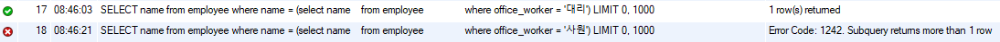
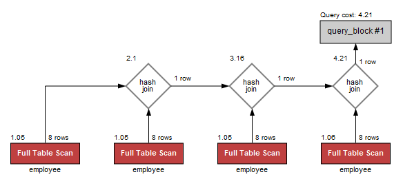

## 1.1 서브쿼리

서브쿼리는 다른 쿼리 내부에 포함되어 있는 SELECT 문을 의미한다. 서브 쿼리를 포함하고 있는 쿼리를 외부쿼리(outer query)라고 하며, 서브 쿼리는
내부 쿼리라고 부른다.

※ 서브쿼리의 장점 : 서브쿼리는 쿼리를 구조화 시키므로, 쿼리의 각 부분을 명확히 구분할 수 있게 해준다. 또한 가독성을 높여준다.

### 1.1.1 서브쿼리의 종류

서브 쿼리는 위치에 따라 3가지 종류로 분류를 할 수 있다.

1. 중첩 서브쿼리 (Nested Subquery) - WHERE 문에 나타나는 서브쿼리
2. 인라인 뷰(Inline View) - FROM 문에 나타나는 서브쿼리
3. 스칼라 서브쿼리(Scalar Subquery) - SELECT 문의 컬럼 이름이나 컬럼 이름에 대한 표현식을 다른 용도로 사용

인터넷에 있는 한 예시를 들고 예시를 시작해보려고 한다.
출처 : https://java119.tistory.com/49?category=809222

```SQL
CREATE TABLE employee (
  id INT AUTO_INCREMENT PRIMARY KEY,
  name VARCHAR(64),
  salary INT,
  office_worker VARCHAR(64)
);

INSERT INTO employee VALUES(1,'허사장',20000000,'사장');

INSERT INTO employee (name,salary,office_worker) VALUES('유부장',10000000,'부장');
INSERT INTO employee (name,salary,office_worker) VALUES('박차장',5000000,'차장');
INSERT INTO employee (name,salary,office_worker) VALUES('정과장',4000000,'과장');
INSERT INTO employee (name,salary,office_worker) VALUES('정대리',3895000,'대리');
INSERT INTO employee (name,salary,office_worker) VALUES('노사원',2500000,'사원');
INSERT INTO employee (name,salary,office_worker) VALUES('하사원',2000000,'사원');
INSERT INTO employee (name,salary,office_worker) VALUES('길인턴',1000000,'인턴');
```

---

[중첩 서브쿼리 예시]

중첩 서브쿼리는 = , > ,IN, ANY 등 다양하게 쓸 수 있다. 각각의 조건마다 값의 개수 차이가 있는데, 
'=' 는 단 한 행만 반환하는 서브쿼리를 작성해야 하고 나머지는 여러 행을 반환하는 서브쿼리를 작성해도 상관없다.

아래의 쿼리는 직급이 대리인 혹은 사원인 사람의 이름을 가져오라는 명령이다. 데이터를 가져오기 전까지 해당 서브쿼리의 행의 개수를
판별할 수 없다. 따라서, 아래의 office_worker = [직급] 부분에서 직급이 대리인 경우엔 에러가 일어나지 않지만 사원인 경우엔 에러가 일어난다.

```SQL
SELECT name
from employee
where name = (select name 
	      from employee
              where office_worker = [직급]);
```

[오류 화면]



---

[인라인 뷰 예시]

인라인 뷰는 SQL에서 서브쿼리를 활용하여 임시적으로 생성된 테이블을 의미한다. 인라인 뷰는 다른 뷰나 테이블이랑 조인될 수 있으며, 
다른 인라인 뷰 내부에서도 사용이 가능하다.

인라인 뷰는 사용할 때에 반드시 alias(별칭)을 작성해주어야지 사용이 가능하다. 

```shell
# Error Code: 1248. Every derived table must have its own alias
select * from (select * from employee where office_worker = '사원');
# 오류가 없음.
select * from (select * from employee where office_worker = '사원') as e1;
```

---

[스칼라 서브쿼리 예시]

스칼라 서브 쿼리는  SELECT 문의 컬럼 이름이나 컬럼 이름에 대한 표현식을 다른 용도로 사용라고 적었는데 예시를 보는 게 더 빠르다. 

굳이 여기서는 서브쿼리를 안써도 될 것 같은데 쓰이는 데는 이유가 있다. 빼고 써보자.

```SQL
select name, salary, (
    select ROUND(AVG(salary), -1)
    from employee) AS '평균급여'
from employee
where name = '정대리';
```

---

### 1.1.2 서브쿼리와 WITH 절
서브 쿼리를 매번 작성할 때마다 넣으면 가독성이 떨어질 수 있다. DBMS에서는 마치 뷰처럼 미리 서브쿼리를 작성해놓고 재사용할 수 있는 방법인
WITH 절을 지원한다. WITH절을 잘 사용하면 가독성을 높인 코드를 작성할 수 있다.

위의 코드 중 하나인 인라인 뷰 예시를 WITH 절을 활용한 방법으로 수정해보았다.

```SQL
WITH e1 as (
    select * from employee where office_worker = '사원'
)
select * from e1;
```

[WITH 절과 관련된 추가사항]

WITH 절은 다른 DBMS는 WITH절을 내부적으로 UNION ALL로 만들어 지원하지 않는 기능이지만 Oracle DBMS에서는 메모리에 실제 테이블처럼 임시로 저장하는 기능을 지원한다.

해당 기능을 Materialize 방식이라고 한다. DISK I/O 한번 이후에는 메모리에 적재되므로 메모리 I/O를 통해 속도를 향상 시킬 수 있다고 하는데,
대용량 시스템(몇십만 건 이상)과 동시성이 높은 시스템에서는 해당 기능을 사용하지 않는 것을 권장한다. 그 이유는 글로벌 영역에 데이터를 적재하고 처리하기 때문이다. 

- WITH절로 생성된 임시 테이블이 크면 메모리를 잡아먹을 수 있다.
- 글로벌 temp table에서 데이터를 적재하고 처리하기에 컨트롤 파일 접근에 대한 경합이 크게 발생할 수 있다.

참고 자료: SK(주) C&C's TECH BLOG / Oracle WITH 절 기본 사용법 및 응용 1

### 1.1.3 서브쿼리와 성능

[연산 비용 추가]<br>
서브쿼리는 실체적인 데이터를 저장하는 게 아니라 서브 쿼리에 접근할 때마다 데이터를 만들어낸다. 그렇기 때문에 서브 쿼리를 불필요하고 과도하게 사용하면
해당 개수만큼 단순 SELECT 문이 나가는 것과 유사하게 동작한다.

한번 다음과 같은 코드를 실행시켜보자.

```SQL
select * from (select * from employee where office_worker = '사원') as e1,
              (select * from employee where office_worker = '부장') as e2,
              (select * from employee where office_worker = '대리') as e3,
              (select * from employee where office_worker = '차장') as e4;
```

그러면 아래와 같이 매 서브쿼리마다 Full Table이 반복적으로 일어나고 이를 Hash join하는 방법으로 처리했음을 확인할 수 있다.



[데이터 I/O 비용 발생] <br>
연산 결과를 어딘가에 저장하기 위해 써야 하는데, 메모리 용량이 충분하다면 메모리에 작성한다. 
하지만, 데이터의 양이 큰 경우 DBMS가 저장소에 있는 파일에 결과를 쓸 수도 있다. 이렇게 되면 접근 속도가 급격하게 떨어질 수 있다.

[최적화 받기 불가능] <br>
서브 쿼리로 만들어지는 데이터는 임시 정보이기 때문에 메타 정보가 하나도 존재하지 않는다.
쿼리 옵티마이저가 쿼리를 해석하기 위해 필요한 정보가 없음.

결과적으로 복잡한 연산을 수행하거나 결과의 크기가 매우 큰 서브 쿼리를 사용할 때에는 성능 리스크를 사용해야 한다.
또한 꼭 서브쿼리를 사용하지 않아도 구현 가능한 지를 고민해보는 것을 권장한다.

참고 자료: SQL 레벨업(미크)