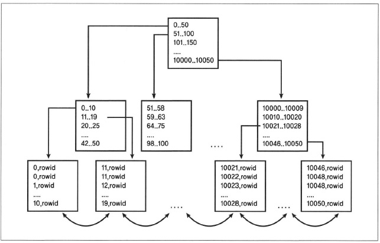
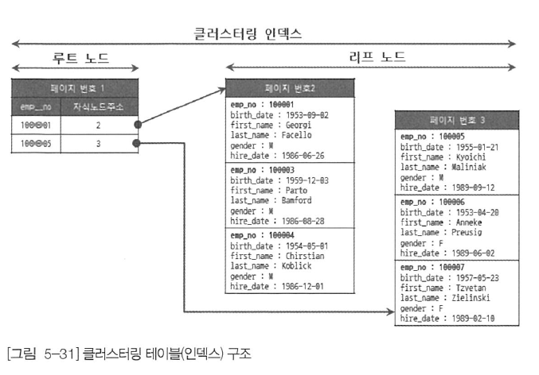
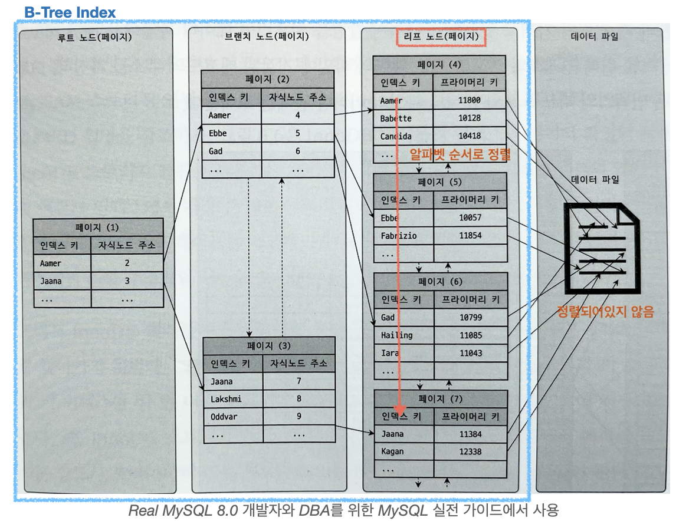
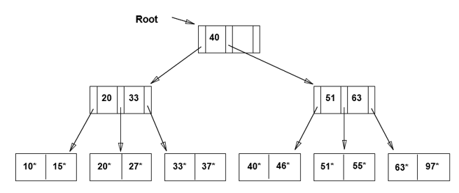
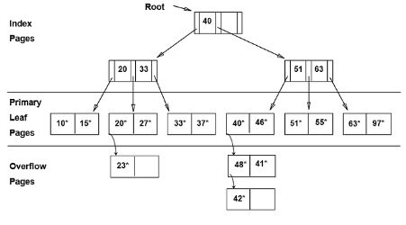

# 2. B-Tree와 인덱스

※ 주의사항:
B-Tree, B+Tree는 서로 구분하지 않고 그냥 B-Tree로 작성하였습니다. InnoDB라 B+Tree의 설명으로 보는 게 맞을 것 같습니다.

## 2.1 B-Tree의 기본적인 구조

B-Tree는 InnoDB 데이터베이스 엔진 스토리지를 위한 여러 가지 기능을 제공하기 위해
채택된 데이터베이스 구조이다. 

B-Tree로 구성된 대표적인 예시는 클러스터링 인덱스와 세컨더리 인덱스 구조가 있다. B-Tree의 기본적인 구조에 관해서 알아보자.



위의 이미지는 B-Tree에 관해서 인터넷에서 가져온 자료이다. B-Tree는 다음과 같이 트리형태로
데이터를 저장한다. 

0x01이라고 되어있는 제일 첫 부분이 루트 노드가 되고 중간에 있는 부분이 브랜치 노드, 맨 아래 부분이 리프 노드가 된다. 

해당 구조를 자세히 보면 내부에서 특정 값에 정렬된 순서대로 탐색을 할 수 있는데 일반적으로 사용하는 이진트리와 다르게 더 많은 값을 가지고 있다.
그 이유는 저기 나온 값들의 모임의 단위가 페이지이기 때문이다. 

또한, 마지막 리프 노드에서는 rowid를 가지거나(세컨더리) 아니면 모든 컬럼에 관한 데이터를 저장한다(PK). 자세한 내용들은 아래에 설명을 할 예정이다.

--- 

### 2.1.1 B-Tree로 구성된 인덱스의 키 추가 및 삭제, 변경

개인적으로 이 파트에서 이미지나 과정을 넣지 않은 이유는 그렇게까지 알아야 하나? 싶다는 생각이 들어서 그렇습니다.

### 인덱스 키 추가

새로운 키 값이 B-Tree에 저장될 때에는 저장될 키 값을 이용해서 B-Tree 상에서 적절한 위치를 검색해야 한다. 저장될 위치가 정해지면 B-Tree의 리프노드에 저장이 된다.

그런데, 리프 노드가 꽉 차서 더이상 저장을 할 수 없을 때에는 리프 노드가 분리되며 이는 상위 노드까지 영향을 미친다. 그렇기 때문에 상대적으로 새로운 키를 추가하는 비용이 비싸다.

인덱스가 늘어남에 따라 INSERT나 UPDATE에 어떻게 영향을 줄 지는 알기가 어렵다. 하지만, Real MySQL에서 옵티마이저에선 인덱스가 없을 때, 클러스터링 테이블에 추가되는 비용이 1이면
세컨더리 인덱스가 추가되는 비용은 1.5로 처리를 한다고 한다. 

만약에 인덱스가 3개 있는 테이블에 레코드 1개를 추가하면 인덱스가 없는 테이블에 레코드 1개 추가하는 비용이 1이라 할 때 5.5로 처리가 된다.

### 인덱스 키 삭제

B-Tree에서는 키 값을 삭제할 때는 직접적으로 데이터를 삭제하는 게 아닌 삭제 마크 작업을 한 뒤 방치하다가 나중에 재활용한다.

※ PK와 Unique 인덱스와 일반 인덱스의 차이

일반 인덱스는 인덱스 키 추가 작업을 지연 시켜 나중에 처리가 가능하다. 하지만 PK와 Unique 인덱스는 중복 체크를 위해
즉시 B-Tree에 추가 삭제가 적용이 됨을 기억하자!


### 인덱스 키 변경

인덱스 키 값에 따라 그 값에 따라 저장될 리프 노드의 위치가 결정이 된다.
B-Tree의 키 값이 변경되는 경우엔 단순히 키 값을 변경하는 방식으로 동작하지 않는다.

결과적으로는 인덱스 상의 값이 바뀌는 결과가 나오겠지만, B-Tree라는 자료 구조 상에서는 모든 연관 있는 키 값을 삭제한 뒤 다시 키 값을
추가하는 방식으로 동작한다.

또한, 이러한 처리는 InnoDB 상의 체인지 버퍼를 통한 최적화를 통해서 지연처리가 일어나기 때문에 즉시 물리적 자료구조에 적용이 되지 않는다.

### 인덱스 키 검색

앞의 추가, 삭제, 변경은 일반적인 레코드의 추가, 삭제, 변경에 비해 높은 비용을 가진다. 하지만 빠른 검색을 가능하게 해준다.

인덱스의 검색은 부등호, 일치 등의 비교 상황에 사용이 가능한데, 조건은 값의 앞 부분이 일치하는 경우에만 사용이 가능하다. 뒷 부분의 검색은 사용이 불가능하며,
데이터가 조작되는 경우에는 값의 앞 부분이라도 인덱스 적용 불가능할 수 있다.

※ 인덱스 키 검색에서 사용 불가능한 조건들 (타 책보다 목록만 보기엔 Real MySQL이 제일 잘 돼있다 생각)
1. NOT-EQUAL로 비교되는 경우
   - WHERE column <> 'N'
   - WHERE column NOT IN (10,11,12)
   - WHERE column IS NOT NULL
   

2. LIKE '%??' 형태로 문자열 패턴이 비교된 경우
    - WHERE column LIKE '%승환'
    - WHERE column LIKE '_승환'
    - WHERE column LIKE '%승%'


3. 스토어드 함수나 다른 연산자로 인덱스 컬럼이 변형된 후 비교된 경우
   - WHERE SUBSTRING(column, 1, 1) = 'X'
   - WHERE DAYOFMONTH(column) = 1


4. NOT-DETERMINSTIC 속성의 스토어드 함수가 비교 조건에 사용된 경우
   - WHERE column = deterministic_function()


5. 데이터 타입이 서로 다른 비교(인덱스 칼럼의 타입을 변환해야 비교가 가능한 경우)
   - WHERE char_column = 10


6. 문자열 데이터 타입의 콜레이션이 다른 경우
   - WHERE utf8_bin_char_column = euckr_bin_char_column

---

### 2.1.2 클러스터링 인덱스와 세컨더리 인덱스

### 클러스터링 인덱스

클러스터링 인덱스는 실제 데이터와 동기화가 된 인덱스이다. 클러스터링 인덱스는 사용자가 직접 Primary key로 설정한 값을 기준으로 사전 순으로 정렬이 되어있다.

아래의 이미지를 보면 클러스터링 인덱스라고 불리지만 사실상 테이블의 전체 컬럼에 대해서 가지고 있으므로 실제 데이터가 저장된 클러스터링 테이블에 가깝다.



실제 데이터와 동기화가 되어있다는 말은 물리적인 순서가 일치함을 말하며 클러스터링 인덱스의 경우에는 유사한 값을 가진 데이터를 주변에 물리적으로 데이터를 저장하기에
공간적 지역성이 높아진다. 

그렇기 때문에 클러스터링 인덱스를 통한 조회는 타 인덱스에 비해서 성능이 굉장히 좋다. 하지만, 문제는 실제 데이터와 물리적 저장 공간을
동기화되었기 때문에 레코드의 저장이나 삭제와 같은 변경이 일어날 시 변경이 훨신 많기 때문에 상대적으로 느리다.

※ 프라이머리 키가 없는 경우 InnoDB의 프라이머리 키 선택
- 프라이머리 키가 없으면 후보키(NOT NULL + 유니크) 중에서 첫 번째 인덱스를 클러스터링 키로 선택
- 자동으로 유니크한 값을 가지는 칼럼 추가 후 클러스터링으로 선택

후자의 자동 컬럼은 사용자에게 노출이 되지 않기 때문에 쿼리를 작성함에 있어 명시적으로 사용할 수가 없다.
그래서 auto_increment를 사용해서라도 반드시 primary key를 설정해줘야 한다.

### 세컨더리 인덱스



세컨더리 인덱스와 클러스터링 인덱스의 가장 큰 차이는 리프노드 부분이다. 위의 클러스터링 인덱스 이미지에선 리프노드를 보면 모든 컬럼에 관한 정보가
담겨져 있는 것을 확인할 수 있다. 반면, 세컨더리 인덱스의 경우에는 인덱스 키와 프라이머리 키 쌍으로 되어 있다.

인덱스의 데이터 저장 방식에 있어 리프노드끼리의 순회에 있어 인덱스 키는 순서에 따른 순차성을 보장한다. 하지만 해당 인덱스 키에 대응하는 프라이머리
키와의 순서는 순차성을 보장하지 못한다. 이 말은 세컨더리 인덱스의 구조는 실제 물리적 데이터와 순서가 다르다는 것을 의미한다.

그렇기 때문에 세컨더리 인덱스의 리프 노드에는 실제 데이터 파일에 저장된 레코드 주소를 가진다. 그렇기에 세컨더리 인덱스에서 찾은 데이터는
한번 더 클러스터링 인덱스를 검색하여 실제 데이터 블록에 접근을 한다.

왜 이렇게 실제 물리적 주소를 담지 않는지는 ISAM과 함께 비교를 하는 부분에 작성을 하도록 하겠다.

※ 세컨더리 인덱스가 리프노드에 PK를 가지는 특성 때문에 주의해야 할 점

결과적으로 인덱스가 생성되고 Insert가 일어나면 레코드마다 인덱스 키 + 프라이머리 키만큼 계속 인덱스가 차지하는 공간이 커진다.

만약 둘을 합한 크기가 50바이트면 100만 건일 때 190MB, 1000만 건이면 1.9GB인데 이게 인덱스가 여러 개면 또 추가적으로 늘어난다.
그러니, 프라이머리 키는 굉장히 신중하게 정하는 것이 중요하다.

※ B+Tree에서 세컨더리 인덱스와 클러스터링 인덱스의 구조적 차이 정리(B-Tree 말하는 거 아님)

세컨더리 인덱스
- 브랜치 노드 : 해당 세컨더리 인덱스의 인덱스 값 + 다음 노드로 향하는 포인터 값을 가짐
- 리프 노드 : 해당 세컨더리 인덱스의 인덱스 값 + 해당 테이블의 PK

클러스터링 인덱스
- 브랜치 노드 : 해당 테이블의 PK + 다음 노드로 향하는 포인터 값을 가짐
- 리프 노드 : 해당 테이블의 전체 컬럼을 가짐. 

결과적으로 페이지 단위로 깊이를 가지더라도 브랜치 노드에 해당하는 한 페이지에
들어갈 수 있는 값의 개수와 리프 노드에 해당하는 한 페이지에 들어가는 값의 개수는 다를 수 있다.

---

### 2.1.3 B-Tree와 이진 트리

탐색 과정에서 순차적으로 값을 찾아가는 것이라면 이진 트리를 사용해도 괜찮지 않을까?라는 질문을 할 수가 있다. 하지만 이진트리로 인덱스를 구성하면
가지는 여러가지 문제점이 있다.

### B-Tree 인덱스의 구조와 디스크 I/O 개선 방식

B-Tree가 Balance Tree라서 비용 측정에 용이하기 때문이라 생각할 수도 있다. 하지만 이진트리도 Balance Tree를 만들 수 있다. 
그 관점보다는 랜덤 디스크 I/O의 관점에서 바라보았을 때 더 큰 장점을 얻을 수 있다.

위의 이미지에서 굉장히 여러 값을 한 곳에 모아서 마치 페이지처럼 정리를 해놓았다. 운영체제에서 배우듯이 데이터를 아주 조금 읽더라도
데이터를 읽을 땐 페이지 단위로 읽어온다. InnoDB에서는 이 페이지 크기를 16KB로 보통 가지고 온다.

해당 페이지에 담길 수 있는 Key와 자식 노드의 주소의 개수는 페이지 / (key + 자식 노드의 주소)가 차지하는 메모리로 구할 수 있다.
만약 key키가 16 바이트이고 주소의 바이트는 12바이트라 가정하고 데이터가 2억 건이 들어가야 할 때 깊이를 비교해보자.

[B-Tree]

1. 위의 계산 식에 따르면 B-Tree에선 대략 585개의 레코드를 페이지마다 담을 수 있다.
2. 2억건은 585 * 585 * 585(200201625)와 거의 값이 비슷하다.
3. 따라서 주어진 조건에서 B-Tree를 이용하면 깊이 3으로 2억 건의 데이터를 처리할 수 있다.

[이진트리]

1. 반면 이진트리를 사용하면 2억 건은 대략 2의 27승 혹은 28승 정도쯤이니 대략 깊이 30으로 2억 건의 데이터를 조회할 수 있다.

깊이가 30대면 괜찮지 않은가 싶기도 한데, 문제는 DISK I/O가 자주 발생한다는 것이다. 깊이가 깊을수록 잘 참조하지 않는 블록에 접근하게 될
것이고 버퍼 hit rate가 감소하고 DISK I/O가 늘어나면서 어플리케이션의 성능이 저하될 것으로 예상된다.

특히나 세컨더리 인덱스를 사용하는 경우에는 세컨더리에서 rowid를 얻어서 클러스터링 인덱스에 다시 접근을 하면 해당 깊이를 두 번 탐색해야한다.
거기에 union이나 in절을 통해서 인덱스를 통해 더 여러 값을 참조해야 한다면 더 성능이 나빠질 것이다.

--- 

### 2.1.4 B-Tree와 ISAM 구조의 차이

※ 주의사항: 이 파트는 직접적으로 책에서 가져온 것이 아닌, 기억에 의존한 글이라 많이 틀렸을 수 있습니다.

ISAM의 세컨더리 인덱스에서는 리프노드에 논리적인 주소를 가진 B-Tree와 달리 실제 물리적인 주소를 가진다.
ISAM에선 프라이머리 키와 세컨더리 인덱스가 차이가 없다.

그런데, 인덱스에서 가상의 primary key를 가지는 세컨더리 인덱스를 구현한 B-Tree가 좋을까? 물리적 주소를 가진 MyISAM이 좋을까에 대해선 고민을 해봐야 한다.

당연히 접근만 따지고 봤을 때는 ISAM의 경우엔 두 번 B-Tree에 접근하지 않아도 되고 바로 메모리나 디스크로 달려가면 되니까 빠르고 좋을 수도 있다.
하지만 ISAM 트리의 구조를 보자.

### 초기 ISAM 트리 구조



### 추가 삽입이 일어났을 때 ISAM 트리 구조



위의 이미지를 보면, B-Tree와 다르게 ISAM의 경우엔 재구성을 통해 완전히 Balance한 depth를 유지하는 것이 아니라 Overflow Pages를 만들어 depth를 늘린다.
이 부분에 있어서는 효율적으로 단일 레코드의 조회에 대해서 읽어야할 블록 수가 더 많을 수도 있어 더 느릴 수 있음을 시사한다.

추가, 삭제, 변경이 일어날 때도 문제가 발생한다. ISAM에선 삭제된 공간을 재활용 효율이 떨어져 실제 데이터 레코드에 비해서 많은 메모리 공간, 디스크 공간을 차지하게 된다.

또한, 초기 데이터에 대해서 고정적으로 놔두기 때문에 이후의 효율성을 위해 주기적인 재구성이 필요하다. 그리고 물리적 주소를 저장했다는 점 때문에 테이블에 인덱스가
많을 수록 물리적 재구성 과정 혹은 물리적 주소 변경 과정이 연관된 모든 인덱스의 변경으로 영향을 주게 된다.

따라서, 이러한 관점으로 보았을 때 이상적인 상황에서의 접근이 좋지만 데이터베이스를 오랜 시간 운영했을 때에는 ISAM이 B-Tree에 비해 불리한 것 같다는 생각이 든다.

---

### 2.1.5 B-Tree와 Hash 인덱스

어차피 칼럼에 대해서 즉시 접근을 하고 싶으면, 굳이 트리형태로 가져가지말고 인덱스로 설정된 칼럼 값을 기준으로 즉시 접근할 수 있는 해시를 사용하면
매우 빠르게 동작할 것 같다는 생각이 든다. 하지만 해시를 선택하지 않은 이유는 무엇인지 궁금해서 알아보았다.

### Hash 인덱스 알고리즘의 문제점
1. Hash를 사용하면 매우 빠르게 접근을 할 수 있겠지만 컬럼 값에 대해서 변경이 일어나게 된다. Index에서 범위 스캔이 가능한 건 문자의 prefix를 통해
범위 검색이 가능하기 때문인데, hash를 사용하면 값 변경으로 인해 이런 것이 불가능하고 이를 지원하려면 결국엔 모든 값을 읽어야 한다.
2. 수정과 변경이 매우 자주 일어나는 테이블에서 이 과정에서 일어나는 충돌에 대해서 처리하는 알고리즘이 필요하고 이 과정에서의 오버헤드가 발생한다.

---

### 2.1.6 유니크 인덱스

### 유니크 인덱스의 읽기 

유니크 인덱스는 테이블이나 인덱스에 같은 값이 2개 이상 저장이 될 수 없음을 의미하는 제약조건이다. MySQL에서는 인덱스 없이 유니크
제약만 설정할 방법이 없다. Unique 설정을 하면 자동으로 생긴다. 문제는 유니크 인덱스는 NULL로 저장이 될 수 있는데 2개 이상 저장이 될 수 있다.

유니크 인덱스가 일반 세컨더리 인덱스와 성능상 큰 차이가 있을 것 같지만 사실상 거의 없다. 유니크하지 않은 세컨더리 인덱스는 중복된 값이 있어
읽어야 할 레코드가 많아 느린 것이다. 읽어야 할 레코드 건수가 같다면 성능상의 차이는 거의 없다.

### 유니크 인덱스의 쓰기

읽기에 있어서는 세컨더리 인덱스와 크게 차이가 안나지만 유니크 인덱스를 쓸 때에는 차이가 있다. 세컨더리 인덱스와의 차이는 중복된 값이 있는지
없는지 확인하는 체크 과정이 하나 추가되는 것이다.

이 체크 과정에서 MySQL에선 유니크 인덱스에서 중복된 값을 체크하기 위해 읽기 잠금을 사용하고, 쓰기를 할 때엔 쓰기 잠금을 사용해서 이 과정에서의
데드락이 자주 발생한다. MySQL에서 인덱스 저장을 위한 체인지 버퍼를 사용하지만, 유니크 인덱스는 중복 체크를 위해 버퍼링을 하지 못하고 결과적으로
유니크 인덱스의 쓰기는 세컨더리 인덱스보다 느리게 동작한다.

※ 불필요한 인덱스와 유니크 인덱스

1. 유니크 인덱스가 있는데 인덱스를 만들면 중복 생성이다.
2. 프라이머리 키와 유니크 인덱스를 동일하게 설정하면 중복 생성이다.

--- 

### 2.1.7 외래키 인덱스

MySQL에서 외래키는 InnoDB 스토리지 엔진에서만 생성할 수 있다. 외래키 제약이 걸리면 자동으로 연관되는 테이블의 칼럼에 인덱스까지 생성된다.
외래키가 제거되지 않는 이상 자동으로 생성된 인덱스를 삭제할 수 없다.

InnoDB의 외래키 특성
- 테이블의 변경(쓰기 잠금)이 발생할 때에만 잠금 경합(잠금 대기)이 발생한다.
- 외래키와 연관되지 않은 컬럼의 변경은 최대한 잠금 경합(잠금 대기)을 발생시키지 않는다.

```SQL
mysql> CREATE TABLE tb_parent (
        id INT NOT NULL,
        fd VARCHAR(100) NOT NULL, PRIMARY KEY (id)
       ) ENGINE=InnoDB;

mysql> CREATE TABLE td_child (
        id INT NOT NULL,
        pid INT DEFAULT NULL,
        fd VARCHAR(100) DEFAULT NULL,
        PRIMARY KEY (id),
        KEY ix_parentId (pid),
        CONSTRAINT child_ibfk_1 FOREIGN KEY (pid) REFERENCES  tb_parent (id) ON DELETE CASCADE
       ) ENGINE=InnoDB;

mysql> INSERT INTO tb_parent VALUES (1, 'parent-1'), (2, 'parent-2');
mysql> INSERT INTO tb_child VALUES (100, 1, 'child-100'), (101, 1, 'child-101'), (200, 2, 'child-200'), (201, 2, 'child-201');
```

위의 예제와 설명은 Real MySQL에 나온 설명이다. 추가적으로 코드 외에도 설명을 하면, child는 CASCADE 옵션이 걸려 있어서 부모가 지워지면
같이 지워진다. 또한 child-100은 parent-1을 부모로 가진다.

외래키 자체에 락이 걸리는 경우는 두 가지 경우가 있다.

### 자식 테이블의 변경이 대기하는 경우

커넥션 1에 대해 다음과 같은 코드를 작성해보자.

```SQL
BEGIN;
UPDATE tb_parent SET fd='changed-2' WHERE id=2;
```

그러면 커넥션 2를 열어서 tb_child 테이블과 tb_parent 테이블을 조회 변경하면서 어떤 작업이 대기하는지 확인해보자. 
아래의 시도를 통해 어떤 케이스에 작업을 대기하게 되는지 확인해볼 수 있다.

```SQL
BEGIN;
SELECT * FROM tb_child WHERE id=200;
SELECT * FROM tb_child WHERE id=100;
UPDATE tb_child SET pid=1 WHERE id=200;
UPDATE tb_child SET pid=2 WHERE id=100;
SELECT * FROM tb_parent WHERE id=2;
SELECT * FROM tb_parent WHERE id=1;
UPDATE tb_parent SET fd='parent1' WHERE id=1;
UPDATE tb_parent SET fd='parent2' WHERE id=2;
ROLLBACK;
```

결과만 말하면 조회는 어떤 것이든지 상관이 없다. READ_COMMITTED 이상이면 아래의 읽기에선 커넥션1에서 변경 시도한 것이 적용되지 않은 내용이 조회가 된다. 

커넥션 2에서 child 측에서의 변경에선 pid가 2인 걸 1로 바뀌는 건 막히지 않는다. 
하지만, 반대로 pid가 1인 걸 지금 변경이 일어나는 pid 2로 바뀔 땐 잠금으로 인해 실행 대기가 일어난다.

커넥션 2에서 parent 측에서의 변경에선 예상 가능하듯 parent1은 상관없지만 parent2는 막힌다. 
외래키가 걸린 테이블 사이에서 변경이 일어나고 있을 때 외래키를 가진 쪽이 외래 키를 자주 바꾼다면, 이런 잠금으로 인한 성능저하를 조심을 해야 할 것 같다.

### 부모 테이블의 변경 작업이 대기하는 경우

이번엔 커넥션 1에 대해 다음과 같은 코드를 작성해보자.

```SQL
BEGIN;
UPDATE tb_child SET fd='changed-100' WHERE id=100;
```

동일하게 커넥션 2를 열어서 tb_child 테이블과 tb_parent 테이블을 조회 변경하며 어떤 작업이 대기하는지 확인해보자.

```SQL
BEGIN;
SELECT * FROM tb_child WHERE id=200;
SELECT * FROM tb_child WHERE id=100;
UPDATE tb_child SET pid=1 WHERE id=200;
UPDATE tb_child SET pid=2 WHERE id=100;
SELECT * FROM tb_parent WHERE id=2;
SELECT * FROM tb_parent WHERE id=1;
UPDATE tb_parent SET fd='parent1' WHERE id=1;
UPDATE tb_parent SET fd='parent2' WHERE id=2;
ROLLBACK;
```

이 경우에도 조회는 어떤 상황이든 상관이 없다.

변경의 경우엔 tb_child 중 id가 100인 값을 수정하면 당연히 레코드 단위로 잠기니 이 경우에는 막히게 된다.
tb_parent의 변경 경우엔 child의 변경으로는 막히지 않는다. 그래서 총 8가지 중 커넥션 1,2가 동시에 변경하는 경우만 변경이 막힌다.

그럼 삭제는 어떨까? 처음 테이블을 만들 땐 CASCADE옵션을 이용해서 부모가 삭제되면 자식도 삭제가 되게 설정을 해놓았다.

```SQL
BEGIN;
DELETE FROM tb_parent WHERE id=1;
```

CASCADE 옵션으로 인해 tb_child 테이블의 변경 중인 레코드에 대해 쓰기 잠금을 얻기 때문에 tb_parent가 삭제될 때 tb_child의 변경중인 레코드에 대한 변경 권한을 얻지 못하기
때문에 삭제할 수 없다.

결과적으로 외래키가 있는 경우 본인 테이블의 변경으로 인한 레코드 잠금이 다른 테이블의 데이터 변경을 막을 수 있다는 점, 이것이 동시 처리에 있어서 성능을 저하시킨다는 점을 기억하고
넘어가야 할 거 같다.

---

### 2.1.8 인덱스의 정렬

인덱스가 오름차순으로만 정렬이 될 것 같다는 느낌이 든다. 하지만, 인덱스도 내림차순도 가능하다.

```SQL
CREATE INDEX ix_teamname_userscore ON employees (team_name ASC, user_score DESC);
```

그리고 꼭 내림차순으로 걸어놓지 않더라도, 인덱스를 스캔하는 과정에서 역순으로 스캔할 수도 있다. 하지만, 성능이 유의미하게 느리다.
그 이유엔 두 가지 이유가 있다.
- 페이지 잠금이 인덱스 정순 스캔에 적합한 구조
- 페이지 내에서 인덱스 레코드가 단방향으로만 연결된 구조

결론은 역순이 안되는 건 아니지만 더 빨리 쓰고 싶다면 쿼리에서 자주 정렬되는 순서대로 인덱스를 생성해야한다는 것이다.