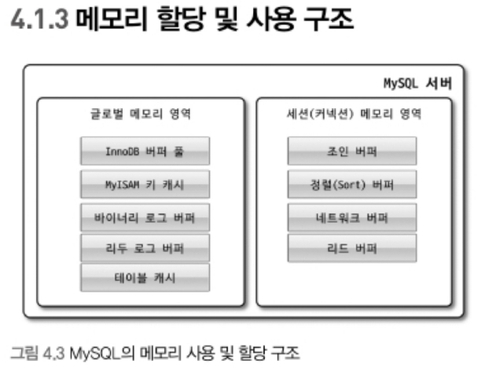

## 2.2 MySQL 아키텍처와 메모리 공간

### 2.2.1 MySQL 서버의 메모리 영역

MySQL에서의 메모리 공간은 글로벌 메모리 영역과 로컬 메모리 영역으로 구분을 할 수 있다. 글로벌 메모리 영역의 모든 메모리
공간은 MySQL 서버가 시작되면서 운영체제로부터 할당이 된다. 운영체제별 정책이 다르지만, MySQL 시스템 변수로 설정해 둔 만큼
운영체제로부터 메모리를 할당 받는다.

---

#### 2.2.1.1 글로벌 메모리 영역

클라이언트 스레드의 수와 무관하게 하나의 메모리만 할당이 된다. 생성된 글로벌 영역은 N개여도 모든 쓰레드에 의해서
공유가 가능하다.

아래는 글로벌 메모리 영역에 해당하는 내용과 글로벌 메모리 영역 설정을 할 수 있는 my.cnf 내의 설정이다.

[my.cnf 내에서 글로벌 메모리 관련 변수 설정]

- InnoDB 버퍼 풀 : innodb_buffer_pool_size
- Redo 로그 버퍼 : innodb_log_buffer_size
- InnoDB 어댑티브 해시 인덱스 : innodb_adaptive_hash_index(ON/OFF)
- 테이블 캐시 : table_open_cache

※ 테이블 캐시란?  
MySQL 서버에서 사용되어지는 각 테이블의 메타 정보를 담고 있는 일종의 캐시이다. MySQL 서버에서 테이블을 읽고 쓸 때에
항상 테이블을 열고 사용하면 닫아야 한다.

이 열고 닫는 과정이 부하가 크게 발생하기 때문에 오픈된 테이블 정보를 테이블 캐시에 담아 놓고 여러 쓰레드가 공유해서
사용함. 일반적인 서비스에선 크게 문제를 유발하지 않지만, 파티셔닝이 많이 되어 있고 테이블 수가 많은 서비스에선
이것이 메모리 부족현상을 겪게 하는 원인이 될 수 있음.

참고/인용 링크: https://small-dbtalk.blogspot.com/2013/09/mysql-table-cache.html

--- 

#### 2.2.1.2 로컬 메모리 영역

로컬 메모리 영역은 세션 메모리 영역이라도 하며 MySQL 서버상에 존재하는 클라이언트 쓰레드가 쿼리를 처리하는데 사용하는 
메모리 영역이다.

로컬 메모리는 각 클라이언트 스레드 별로 독립적으로 할당이 되며 절대 공유되어 사용되지 않는다는 특성이 있다. 설정을 잘못하면
MySQL 서버가 메모리 부족으로 멈춰 버릴 수 있으므로 적절한 메모리 공간을 설정해야 한다.

로컬 메모리 공간은 커넥션이 열려 있는 동안 남아 있는 공간(커넥션 버퍼, 결과 버퍼), 쿼리 실행하는 순간에만 할당했다가 해제하는
공간(소트 버퍼, 조인 버퍼)도 있다.

[my.cnf 내에서 로컬 메모리 영역 관련 변수 설정]

- 정렬 버퍼 : sort_buffer_size
- 조인 버퍼 : join_buffer_size
- 바이너리 로그 캐시 : binlog_cache_size
- 네트워크 버퍼 : net_buffer_length, max_allowed_packet

※ 주의사항 
로컬 메모리 영역은 개별 영역별 size * max_connection 수 임을 잊지말자.
- max_connection 변수 : max_connections

---

### 2.2.2 쿼리 캐시

여러 책에서 쿼리 캐시를 언급하는 곳이 있다. 쿼리 캐시는 SQL 실행 결과를 메모리에 캐시하고 동일한 SQL 쿼리 실행 시
테이블 읽기 없이 즉시 결과를 반환하는 역할을 한다. 하지만, 쿼리 캐시가 동시성 이슈를 발생하는 원인이 되었기 때문에
MySQL에서는 8.0으로 올라오며 MySQL 서버에서 완전히 제거 되었다.

---
