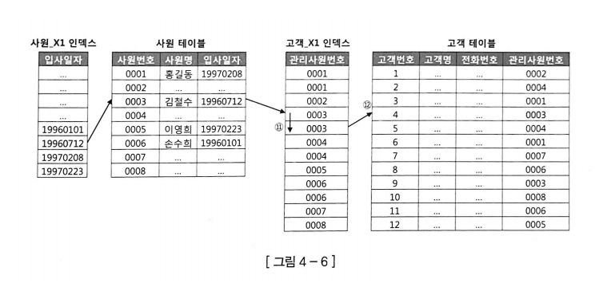
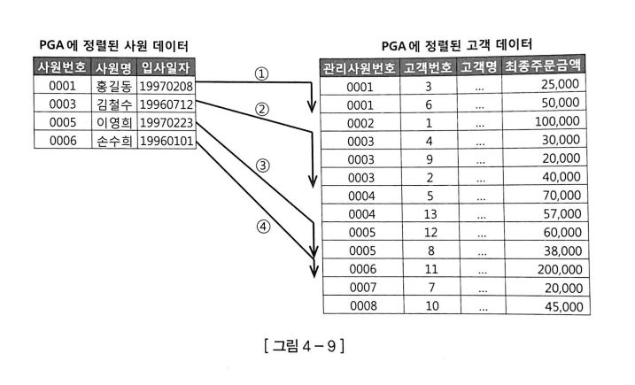
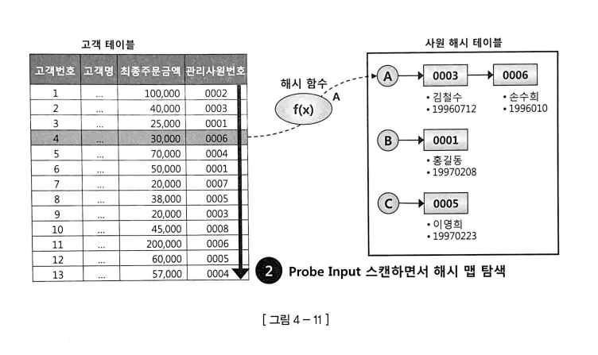

# TableJoin

# 테이블 조인 쿼리 실행 계획

## 1. 조인 수행 방식

### (1) NL 조인

NL 조인은 인덱스를 이용한 조인 방식으로 가장 기본적인 조인이다. 중첩 루프문(Nested Loop)과 같은 수행 구조를 사용한다. 즉, Outer 테이블의 각 레코드마다 Inner 테이블에서 조건에 부합하는 레코드를 조회하며 조인한다. 일반적으로 NL 조인은 양쪽 테이블 모두 인덱스를 이용한다. Outer 쪽 테이블은 사이즈가 크지 않으면 인덱스를 이용하지 않을 수도 있다. Table Full Scan을 하더라도 딱 한 번만 하면 되기 때문이다. 하지만 Inner 쪽 테이블은 반드시 인덱스를 사용해야 한다. 인덱스를 이용하지 않을 경우, Outer 루프에서 읽은 건수만큼 Table Full Scan을 해야하기 때문이다.

NL 조인의 첫 번째 특징은 랜덤 액세스 위주의 조인 방식이라는 점이다. 레코드 하나를 읽기 위해 블록을 통째로 읽기 때문에 대량의 데이터를 조인할 때 불리하다. 두 번째 특징은 조인을 한 레코드씩 순차적으로 진행한다는 점이다. 이때문에 아무리 큰 테이블을 조인하더라도 부분범위 처리가 가능하면 매우 빠른 응답 속도를 낼 수 있다. 이런 특징을 종합하여 볼 때, NL 조인은 소량 데이터를 주로 처리하거나 부분범위 처리가 가능한 온라인 트랜잭션 처리 시스템(OLTP)[**⁽¹⁾**](#주석)에 적합한 조인 방식이라고 할 수 있다.

### (2) 소트 머지 조인

소트 머지 조인은 소트 단계, 머지 단계 두 단계로 진행된다. 먼저 소트 단계에서는 각 테이블을 조인 컬럼 기준으로 정렬한 뒤 PGA[**⁽²⁾**](#주석) 영역에 할당된 Sort Area에 저장한다. 그리고 머지 단계에서는 NL 조인처럼 Outer 테이블의 각 레코드마다 Inner 테이블의 레코드를 조회하며 조인한다. Inner 테이블이 정렬되어 있으므로 조인 대상 레코드가 시작되는 지점을 쉽게 찾을 수 있고, 조인에 실패하는 레코드를 만나는 순간 바로 멈출 수 있다. 즉, Inner 테이블의 데이터를 매번 Full Scan 하지 않아도 된다. 이처럼 Sort Area에 저장한 데이터 자체가 인덱스 역할을 하므로 조인 컬럼에 인덱스가 없어도 사용할 수 있다.

NL 조인은 인덱스를 사용하기 때문에 조인 과정에서 액세스하는 모든 블록을 랜덤 액세스 방식으로 매번 버퍼캐시와 디스크에서 읽어온다. 반면 소트 머지 조인은 양쪽 테이블로부터 조인 대상 집합을 일괄적으로 읽어 PGA에 저장한 후 조인한다. 따라서 대량 데이터 조인으로 NL 조인의 성능이 떨어질 때 NL 조인 대신 소트 머지 조인을 사용할 수 있다.

또한 대부분의 경우에 해시 조인이 소트 머지 조인보다 빠르지만 해시 조인은 조인 조건식이 등치(=) 조건이 아닐 때 사용할 수 없다. 이때문에 조인 조건식이 등치(=) 조건이 아닌 대량 데이터 조인이나 조인 조건식이 아예 없는 크로스 조인에서는 주로 소트 머지 조인을 사용한다.

### (3) 해시 조인

해시 조인도 소트 머지 조인처럼 두 단계로 진행된다. 먼저 Build 단계에서는 작은 쪽의 테이블을 읽어 해시 테이블(해시 맵)을 생성한 뒤 PGA 영역에 할당된 Hash Area에 저장한다. 그리고 Probe 단계에서는 큰 쪽의 테이블을 읽은 뒤, 해시 테이블에서 해당하는 해시 체인을 탐색하면서 조인한다.

해시 조인은 소트 머지 조인과 마찬가지로 인덱스를 사용하지 않고 PGA에서 빠르게 데이터를 탐색하고 조인한다. 또한 소트 머지 조인은 사전에 양쪽 테이블을 모두 정렬해서 PGA에 담는 반면, 해시 조인은 한쪽만 읽어 해시 맵을 만든다. 따라서 PGA 영역이 모자라 디스크 영역까지 사용해 디스크 I/O가 발생하는 경우는 거의 없다. 즉, 해시 조인은 NL 조인처럼 조인 과정에서 발생하는 랜덤 액세스 부하가 없고, 소트 머지 조인처럼 양쪽 집합을 미리 정렬하는 부하도 없다. 따라서 대량의 데이터를 조인할 때는 일반적으로 해시 조인이 가장 빠르다.

## 2. 조인 방식 선택 기준

기본적으로 소량의 데이터를 조인할 때는 NL 조인을 사용하고 대량의 데이터를 조인할 때는 해시 조인을 사용한다. 만약 대량의 데이터를 조인하는데 조인 조건식이 등치(=)가 아닐 경우에는 소트 머지 조인을 사용한다. 이때 소량과 대량의 기준은 단순히 데이터 양이 많고 적은 것이 아니다. NL 조인 기준으로 최적화했는데도 랜덤 액세스가 많아 만족할만한 성능을 낼 수 없다면 대량 데이터 조인에 해당한다.

수행 빈도가 높은 소량의 데이터 조인은 해시 조인이 약간 더 빠르더라도 NL 조인을 선택하는 것이 좋다. NL 조인에 사용하는 인덱스는 영구적으로 유지하면서 다양한 쿼리를 위해 공유 및 재사용하는 자료구조이다. 반면, 해시 테이블은 단 하나의 쿼리를 위해 생성하고 조인이 끝나면 곧바로 소멸한다. 같은 쿼리를 100개의 프로세스가 동시에 수행하면, 해시 테이블도 100개가 만들어진다. 따라서 수행시간이 짧으면서 수행빈도가 매우 높은 쿼리를 해시 조인으로 처리하면 CPU와 메모리 사용률이 크게 증가한다.

즉 해시 조인은 수행 빈도가 낮고 쿼리 수행 시간이 오래 걸리는 대량의 데이터를 조인할 때 주로 사용한다. 이는 배치 프로그램, 데이터 웨어하우스[**⁽³⁾**](#주석), 온라인 분석 처리(OLAP)[**⁽⁴⁾**](#주석)성 쿼리의 특징이기도 하다. 일반적으로 OLTP 환경에서는 NL 조인이 더 적합하다.

### 주석

---

[**1.**](#1-nl-조인) 동시에 발생하는 다수의 트랜잭션을 처리하는 데이터 처리 유형

[**2.**](#2-소트-머지-조인) 프로세스에 종속적인 고유 데이터를 저장하기 위해 각 프로세스에 할당된 메모리 영역

[**3.**](#2-조인-방식-선택-기준) 의사결정에 도움을 주기 위한 통합된 데이터를 가진 양질의 데이터베이스

[**4.**](#2-조인-방식-선택-기준) 데이터 웨어하우스 등에 있는 대량의 데이터를 분석하기 위한 기술