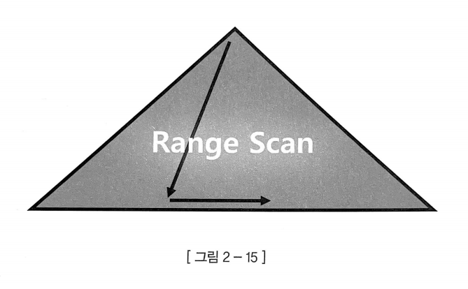
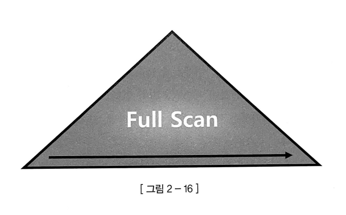
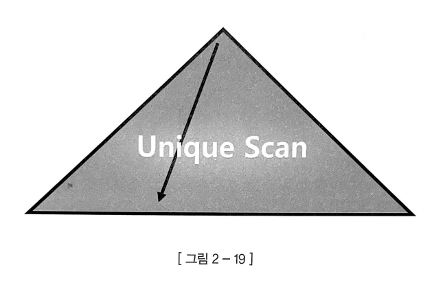
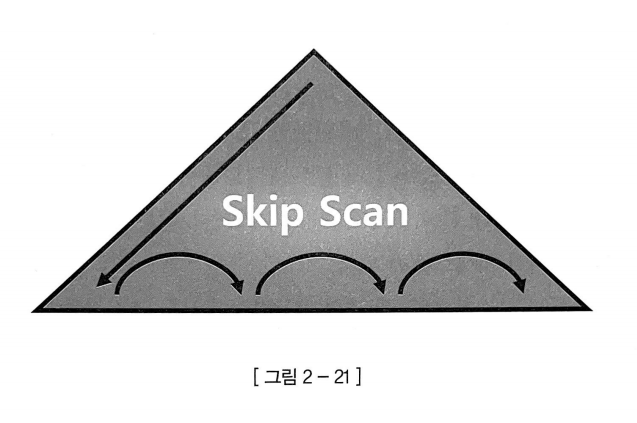
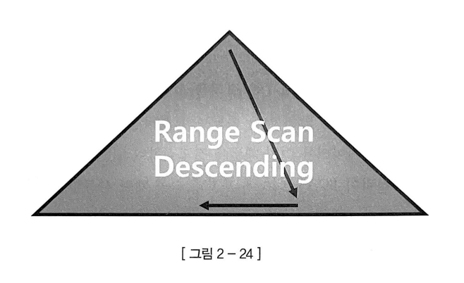

# 단일 테이블 쿼리 실행 계획

## 1. 전체 테이블 스캔

테이블에 저장된 데이터를 읽기 위해 테이블 전체를 스캔하는 방식이다. 시퀀셜 액세스[**⁽¹⁾**](#주석)와 Multiblock I/O[**⁽²⁾**](#주석) 방식을 사용한다. DB 버퍼캐시에서 캐시 미스가 발생하면 한 번의 I/O 요청을 통해 인접해있는 수십~수백 개의 블록을 한꺼번에 읽어들인다. 따라서 큰 테이블에서 소량의 데이터를 검색할 때는 적절하지 않다. 이 방식을 사용하는 SQL은 저장소를 읽어들이는 성능이 좋아지면 그와 비례해 성능도 좋아진다.

## 2. 인덱스 스캔

테이블에 저장된 데이터를 읽기 위해 랜덤 액세스[**⁽³⁾**](#주석)와 Single Block I/O[**⁽⁴⁾**](#주석) 방식을 사용한다. 캐시 미스가 발생하면, 레코드 하나를 읽기 위해 매번 I/O 요청을 하고 대기(blocked) 상태가 된다. 이 방식을 사용하는 SQL은 저장소를 읽어들이는 성능이 수십 배 좋아져도 성능은 조금 밖에 좋아지지 않는다. 게다가 읽었던 블록을 반복해서 읽는 비효율도 있다. 따라서 큰 테이블에서 아주 적은 일부 데이터를 빨리 찾고자 할 때 적절하며, 읽을 데이터가 일정량을 넘으면 Table Full Scan보다 불리하다.

### (1) Index Range Scan

B*Tree 인덱스의 가장 일반적이고 정상적인 형태의 액세스 방식이다. 인덱스 루트에서 리프 블록까지 수직적으로 탐색[**⁽⁵⁾**](#주석)한 후에 필요한 범위만큼만 수평적으로 탐색[**⁽⁶⁾**](#주석)한다. Index Range Scan으로 처리하려면 선두 컬럼을 기본 상태 그대로 조건절에 사용해야 한다.

### (2) Index Full Scan

수직적 탐색없이 인덱스 리프 블록을 처음부터 끝까지 수평적으로 탐색하는 방식이다. 인덱스 선두 컬럼이 조건절에 없으면 옵티마이저는 먼저 Table Full Scan을 고려한다. 그런데 컬럼 수가 많거나 크기가 크고, 인덱스의 일부 컬럼을 활용해 데이터를 필터링할 수 있는 경우를 생각해보자. Table Full Scan을 사용해 모든 레코드의 모든 컬럼을 가져오는 것보다 인덱스를 전부 탐색하며 필터링을 통과한 레코드만 전체 컬럼을 불러오는 것이 더 효과적일 것이다. 이것이 Index Full Scan 방식이다. 하지만 이는 적절한 인덱스가 없어 차선책으로 선택한 것이다. 따라서 수행빈도가 높은 경우에는 필요한 컬럼이 선두인 인덱스를 생성하는 것이 좋다.

### (3) Index Unique Scan

수직적 탐색만으로 데이터를 찾는 스캔 방식으로서, Unique 인덱스를 ‘=’ 조건으로 경우에 작동한다. Unique 인덱스가 존재하는 컬럼은 중복 값이 입력될 수 없다. 따라서 ‘=’ 조건에 맞는 데이터를 하나 찾는 순간 더 이상 탐색할 필요가 없기 때문에 여러 리프 블록을 수평적으로 탐색할 필요가 없다. Unique 인덱스를 범위검색 조건으로 검색하거나, Unique 결합 인덱스에 대해 일부 컬럼만으로 검색할 때는 Index Range Scan으로 처리된다.

### (4) Index Skip Scan

루트 또는 브랜치 블록에서 읽은 컬럼 값 정보를 이용해 조건절에 부합하는 레코드를 포함할 가능성이 있는 리프 블록만 골라서 액세스하는 스캔 방식이다. 조건절에 빠진 인덱스 선두 컬럼의 Distinct Value[**⁽⁷⁾**](#주석) 개수가 적고 후행 컬럼의 Distinct Value 개수가 많을 때 유용하다. 선두 컬럼에 대한 조건절을 있고, 중간 컬럼에 대한 조건절이 없는 경우에도 사용할 수 있다.

### (5) Index Fast Full Scan

Index Full Scan은 인덱스의 논리적 구조를 따라 리프 블록을 읽어들인다. 반면, Index Fast Full Scan은 물리적으로 디스크에 저장된 순서대로 인덱스 리프 블록들을 읽어들인다. 즉, 논리적인 인덱스 트리 구조를 무시하고 인덱스 세그먼트 전체를 Multiblock I/O 방식으로 스캔한다. 덕분에 Index Full Scan보다 빠르지만 결과가 인덱스 키 순서대로 정렬되지 않는다.

### (6) Index Range Scan Descending

Index Range Scan과 기본적으로 동일한 스캔 방식이며, 인덱스를 뒤에서부터 앞쪽으로 스캔하기 때문에 내림차순으로 정렬된 경과를 얻는다는 차이점이 있다.

## 3. ORDER BY

### (1) 인덱스 사용

B*Tree 인덱스는 이미 키 값을 기준으로 정렬되어 있고 순서대로 읽기만 하면 되기 때문에 일반적으로 가장 빠른 방법이다. ORDER BY 처리를 위해 인덱스를 사용하려면 다음과 같은 조건을 만족해야 한다.

- ORDER BY의 컬럼이 제일 먼저 읽는 테이블에 속하며 인덱스의 선두 컬럼이다.
- 정렬 순서(정순, 역순)에 맞게 생성된 인덱스가 있다.
- WHERE 절에 제일 먼저 읽는 테이블의 컬럼에 대한 조건이 있다면 그 조건과 ORDER BY의 컬럼은 같은 인덱스를 사용할 수 있다.
- 조인이 있을 경우 NL 조인을 사용한다.

### (2) Filesort 사용

이 방식은 드라이빙 테이블[**⁽⁸⁾**](#주석)만 정렬하는 방식과 임시 테이블을 이용해 정렬하는 방식 2가지로 나눌 수 있다. 조인이 없거나, ORDER BY 절에 드라이빙 테이블의 칼럼만 포함됐다면 드라이빙 테이블만 정렬하면 된다. 하지만 ORDER BY 절에 드리븐 테이블[**⁽⁹⁾**](#주석)이 사용됐다면 조인 결과를 임시 테이블로 저장한 뒤 임시 테이블에서 정렬을 진행해야 한다. 일반적으로 조인을 수행하면 레코드 건수는 배로 많아지므로 성능이 저하된다. 따라서 가능하면 드라이빙 테이블만 정렬한 다음 조인을 수행하는 것이 좋다.

Filesort의 경우, 정렬해야 할 레코드가 많지 않으면 메모리에서 처리되기 때문에 충분히 빠르다. 하지만 레코드 건수가 많아져 메모리 내에서 해결되지 못할 경우 디스크 공간까지 사용한다. 즉, 많은 디스크 I/O가 발생하며 성능이 저하된다. 또한 정렬 작업이 쿼리 실행 시 처리되므로 레코드 대상 건수가 많아질수록 쿼리의 응답 속도가 느려진다. 따라서 SQL을 작성할 때 불필요한 정렬이 발생하지 않도록 주의해야 한다.

### 주석

---

[**1.**](#1-전체-테이블-스캔) 논리적 또는 물리적으로 연결된 순서에 따라 차례대로 블록을 읽는 방식

[**2.**](#1-전체-테이블-스캔) 한 번에 여러 블록씩 요청해서 메모리에 적재하는 방식

[**3.**](#2-인덱스-스캔) 논리적, 물리적인 순서를 따르지 않고, 레코드 하나를 읽기 위해 한 블록씩 접근하는 방식

[**4.**](#2-인덱스-스캔) 한 번에 한 블록씩 요청해서 메모리에 적재하는 방식

[**5.**](#1-index-range-scan) 정렬된 레코드 중 조건을 만족하는 첫 번째 레코드를 찾는 과정

[**6.**](#1-index-range-scan) 찾고자 하는 데이터가 더 이상 나오지 않을 때까지 인덱스 리프 블록을 수평적으로 스캔하는 과정

[**7.**](#4-index-skip-scan) 컬럼이 가지고 있는 값의 종류 (성별이면 남성**·**여성, 학년이면 1학년**·**2학년**·**3학년 등)

[**8.**](#2-filesort-사용) 조인 시 먼저 액세스되어 접근 경로를 주도하는 테이블

[**9.**](#2-filesort-사용) 드라이빙 테이블이 액세스된 이후 나중에 액세스되는 테이블