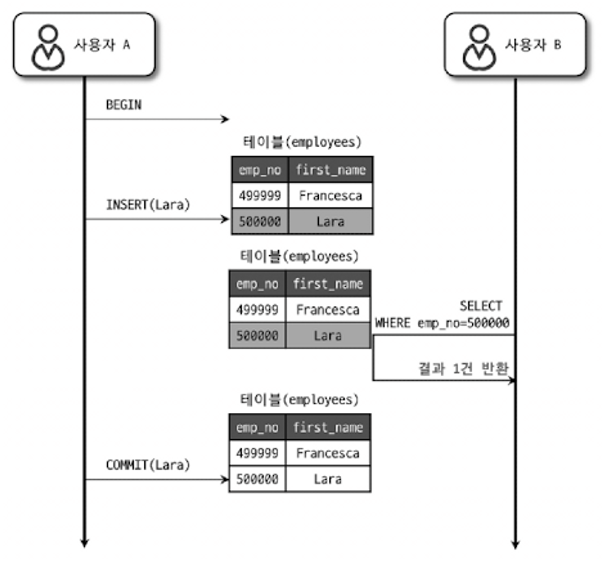
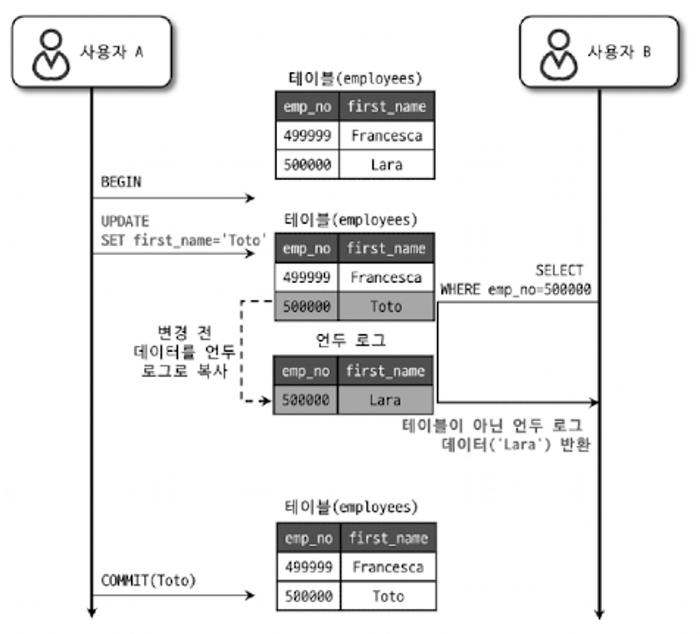
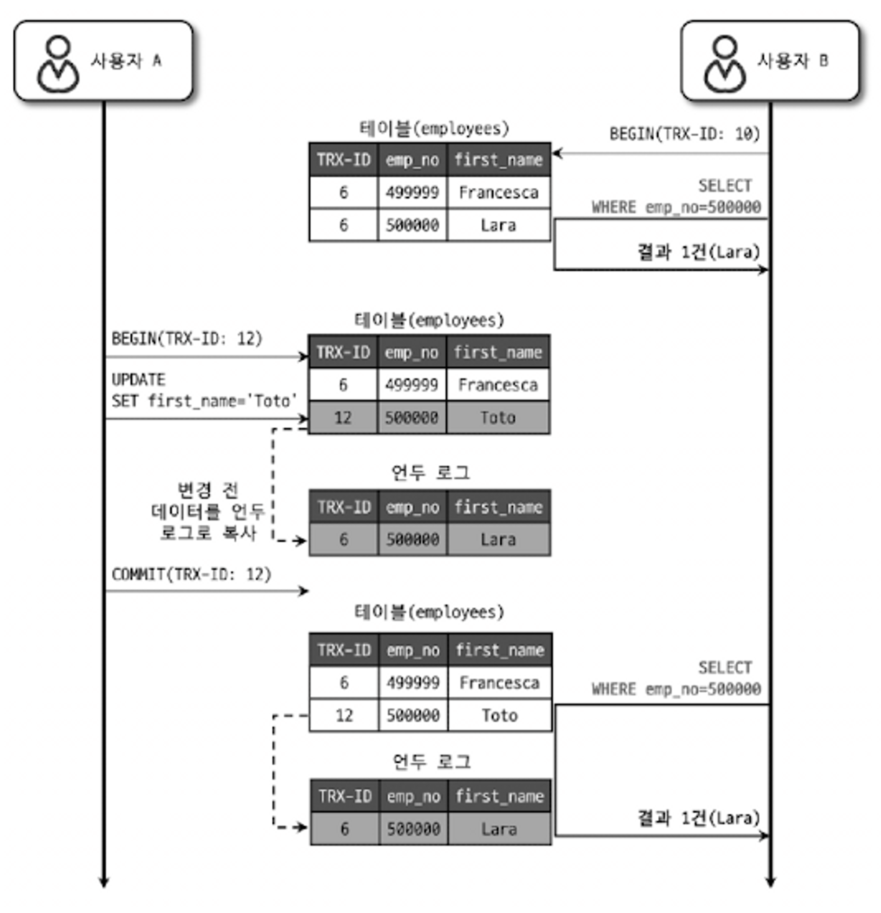

# 트랜잭션

> 트랜잭션이란 작업의 최소 단위를 의미하며 작업을 수행 후 모두 적용됐거나(COMMIT 실행) 아무것도 적용되지 않도록(ROLLBACK 실행) **데이터의 정합성**을 보장해주는 논리적 작업 단위이다.

## 1. 트랜잭션의 4가지 특성(ACID)
- **원자성**(Atomicity): 트랜잭션의 연산은 모두 실행되거나, 모두 실행되지 않아야 한다. (All or Nothing)
- **일관성**(Consistency): 트랜잭션이 실행을 성공적으로 완료하면 일관성 있는 DB 상태를 유지해야 한다.
- **고립성**(Isolation): 트랜잭션을 수행 시 다른 트랜잭션의 연산 작업이 끼어들 수 없다.
- **지속성**(Durability): 성공적으로 수행된 트랜잭션은 영원히 반영된다.


## 2. 트랜잭션의 적절한 범위
> 트랜잭션의 **범위는 최소화**하는 것이 좋다. 일반적으로 데이터베이스의 커넥션의 개수가 제한적이어서 각 단위 프로그램이 커넥션을 소유하는 시간이 길어질수록 여유 커넥션의 개수는 줄어든다. 이는 DBMS 서버가 높은 상태로 부하 상태로 빠지거나 위험한 상태에 빠질 수 있다.

다음은 사용자가 게시판에 게시물을 작성한 후 저장 버튼을 클릭했을 때 서버에서 처리하는 내용을 정리한 예시이다.

``` text
1) 처리 시작
    ==> 데이터베이스 커넥션 생성
    ==> 트랜잭션 시작
2) 사용자의 로그인 여부 확인
3) 사용자의 글쓰기 내용의 오류 여부 확인
4) 첨부로 업로드된 파일 확인 및 저장
5) 사용자의 입력 내용을 DBMS에 저장
6) 첨부 파일 정보를 DBMS에 저장
7) 저장된 내용 또는 기타 정보를 DBMS에서 조회
8) 게시물 등록에 대한 알림 메일 발송
9) 알림 메일 발송 이력을 DBMS에 저장
    <== 트랜잭션 종료(COMMIT)
    <== 데이터베이스 커넥션 반납
10) 처리 완료
```

다음 처리 절차의 문제점을 살펴보자.

- 실제로 DBMS에 데이터를 저장하는 작업(트랜잭션)은 5번부터 시작된다.

- 8번과 같이 메일 번송이나 FTP 파일 전송 작업 또는 네트워크를 통해 원격 서버와 통신하는 등과 같은 작업은 DBMS 트랜잭션에서 제거하는 것이 좋다.
- 따라서, 사용자의 입력 정보를 저장하는 5, 6번은 하나의 트랜잭션으로 묶어야 하며, 7번과 같이 데이터의 단순 조회의 경우 트랜잭션에 포함할 필요는 없다. 또한, 9번 알림 메일 발송은 성격이 다르기에 별도의 트랜잭션으로 분리하는 것이 좋다.


위 부분을 보완한 결과는 다음과 같다.

```text
1) 처리 시작
2) 사용자의 로그인 여부 확인
3) 사용자의 글쓰기 내용의 오류 여부 확인
4) 첨부로 업로드된 파일 확인 및 저장
    ==> 데이터베이스 커넥션 생성
    ==> 트랜잭션 시작
5) 사용자의 입력 내용을 DBMS에 저장
6) 첨부 파일 정보를 DBMS에 저장
    <== 트랜잭션 종료(COMMIT)
7) 저장된 내용 또는 기타 정보를 DBMS에서 조회
8) 게시물 등록에 대한 알림 메일 발송
    ==> 트랜잭션 시작
9) 알림 메일 발송 이력을 DBMS에 저장
    <== 트랜잭션 종료(COMMIT)
    <== 데이터베이스 커넥션 반납
10) 처리 완료
```


## 3. 트랜잭션의 격리 수준
> 트랜잭션의 격리 수준(isolation level)이란 여러 트랜잭션이 동시에 처리될 때 특정 트랜잭션이 다른 트랜잭션에서 변경하거나 조회하는 데이터를 볼 수 있게 허용할지 말지를 결정하는 것이다.

|             | DIRTY READ | NON-REPEATABLE READ | PHANTOM READ |
|:----------------:|:----------:|:-------------------:|:------------:|
| READ UNCOMMITTED |     발생      |          발생          |      발생       |
|  READ COMMITTED  |     없음      |          발생          |      발생       |
| REPEATABLE READ  |     없음      |          없음          | 발생(InnoDB는 없음)  |
|   SERIALIZABLE   |     없음      |          없음          |      없음       |


### (1) READ UNCOMMITTED
- 트랜잭션에서 변경한 내용이 COMMIT이나 ROLLBACK **상관없이 다른 트랜잭션에서 조회**할 수 있는 격리 수준이다.



- 위 이미지에서 사용자 A가 ROLLBACK을 하는 경우, 데이터가 존재하지 않게 된다. 즉, `DIRTY READ`가 발생한다.
- 이로 인해 데이터 정합성 문제가 발생할 수 있어, RDBMS 표준에서는 READ UNCOMMITTED를 인정하지 않으며, READ COMMITTED 이상의 격리 수준 사용을 권장한다.


### (2) READ COMMITTED
- 오라클 DBMS에서 기본으로 사용되는 격리 수준으로, 온라인 서비스에서 가장 많이 사용된다.
- 해당 격리 수준에서는 **COMMIT이 완료된 데이터만 다른 트랜잭션에서 조회**할 수 있다.



- 변경전의 데이터는 **언두 로그**에 저장하고, COMMIT 되기 전에 다른 트랜잭션에서 조회한다면 언두 로그에 있는 변경 전 데이터를 반환한다.
- 하지만, 한 트랜잭션에서 동일한 데이터를 여러 번 요청하면, 항상 같은 결과를 가져오지 않을 수 있다. 즉, `NON-REPEATABLE READ`가 발생한다.
  * 해당 문제는 일반적인 웹 서비스에서는 큰 문제가 아닐 수 있지만, 금전적인 거래와 같은 경우에는 문제가 발생할 수 있다.


### (3) REPEATABLE READ
- MySQL InnoDB에서 기본적으로 사용되는 격리 수준이다.
- 해당 격리 수준은 MVCC(Multi Version Concurrency Control)를 위해 언두 영역에 백업된 이전 데이터를 이용해 동일 트랜잭션 내에서는 동일한 결과를 보여줄 수 있도록 보장한다.

  - 모든 InnoDB의 트랜잭션은 고유한 트랜잭션 번호(순차적으로 증가)를 가지며, 언두 영역에 백업된 모든 레코드에는 변경을 발생시킨 트랜잭션의 번호가 포함되어 있다.
  - 언두 영역에 백업된 데이터는 InnoDB 스토리지 엔진이 불필요하다고 판단하는 시점에 주기적으로 삭제한다.
  - REPEATABLE READ는 MVCC를 보장하기 위해 실행중인 트랜잭션 가운데 가장 오래된 트랜잭션 번호보다 



- A 트랜잭션에서 이름을 <i>'Toto'</i>로 변경했지만, 사용자 B의 10번 트랜잭션 안에서 실행되는 모든 SELECT 쿼리는 트랜잭션 번호가 10(자신)보다 작은 트랜잭션 번호에서 변경한 것만 보게 되어 언두 로그에 있는 <i>'Lara'</i>만 조회하게 된다.
- 만약, 한 사용자가 BEGIN으로 트랜잭션을 시작하고 장시간 트랜잭션을 종료하지 않으면 언두 영역이 백업된 데이터로 무한정 커질 수 있고 이는 MySQL 서버의 처리 성능 저하를 야기할 수 있다.
- 해당 격리 수준에서 다른 트랜잭션에서 수행한 변경 작업에 의해 레코드가 보였다 안 보였다 하는 현상인 `PHANTOM READ` 현상이 발생할 수 있다.


### (4) SERIALIZABLE
- 가장 단순하고 엄격한 격리 수준으로, 그만큼 동시성 처리 성능이 다른 격리 수준보다 떨어진다.
- 한 트랜잭션에서 읽고 쓴 레코드를 다른 트랜잭션에서 절대로 접근할 수 없다.
- InnoDB는 갭락과 넥스트 키 락 덕분에 **REAPEATABLE READ**에서 `PHANTOM READ`가 발생하지 않기에 굳이 SERIALIZABLE을 사용할 필요는 없다.

