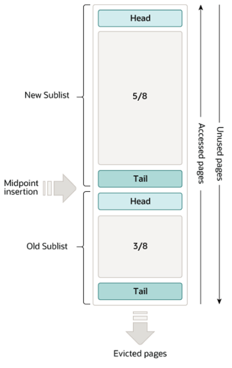

## Database I/O Architecture

데이터 베이스에서 I/O architecture는 아래와 같이 생겼다. 개별 트랜잭션은 SQL 구문의 연속이며 이는 reads와 writes의 연속으로 볼 수 있다.
SELECT 문은 페이지에서 데이터를 읽고 이외의 일은 페이지에 데이터를 쓰는 작업을 한다.

여기서 Buffer HIT과 MISS의 의미에 대해 이야기하면 InnoDB에는 buffer가 존재한다. 
그 buffer 내의 데이터가 존재하는 경우 DRAM 메모리 영역에서 데이터를 가져오고 그렇지 않으면 디스크에서
데이터를 가져온다.

그렇다면 버퍼풀이 어떤 구조로 되어있는지 알아보자. 버퍼풀은 다음과 같이 3가지 영역으로 나뉜다.
- Free list : 아무런 데이터가 쓰여지지 않은 빈 페이지가 담긴 리스트
- LRU list : 모든 페이지를 담고 있는 리스트
- Flush list : 메모리 상에서 데이터가 변조가 일어났지만 아직 디스크에서 Flush가 일어나 반영되지 않은 채로
dirty flag 표시만 되어있는 페이지를 담고 있는 리스트

## 버퍼풀 내에서 Hit ratio의 중요성

#### Hit Ratio = 버퍼풀에서 데이터를 찾아온 경우 / 디스크와 버퍼풀에서 데이터를 찾은 경우

Hit Ratio는 높을수록 좋다. 디스크 접근 속도와 DRAM 접근 속도가 1000배 정도 차이가 난다고 해보자.
그러면 데이터 1000개를 가져온다고 했을 때 디스크에서 가져올 때 각 5ms, 메모리에서 가져올 때 5us라고 해보면
hit ratio가 90퍼센트일 땐 900 x 5us + 100 x 5ms = 504.5ms의 시간이 걸린다. 

반면 hit ratio가 99퍼센트이면 990 x 5us + 10 x 5ms = 54.95ms로 훨신 적은 시간이 걸린다.
따라서 최대한 메모리에 적재된 버퍼풀 내에서 데이터를 찾아 데이터를 가져올수록 빠른 데이터 처리를 할 수 있다.

## InnoDB 내의 버퍼풀과 교체 정책

InnoDB의 버퍼풀은 캐싱용 교체 정책으로 LRU(Least Recently Used)를 사용한다.
그런데 데이터 베이스의 특성상 full table scan으로 배치처리를 하거나 데이터를 가져오는 일이 굉장히 많다.

이러한 상황 속에서 단순한 LRU 정책을 가지고 동작을 하는 경우, 두 가지 문제가 발생한다.
- 모든 LRU 데이터를 위의 작업을 할 때마다 날려버려야 한다.
- 한번만 읽고 더이상 보지 않을 가능성이 높은 데이터를 메모리에 적재해야 한다.

이러한 데이터 유실과 비효율성을 방지하기 위해서 InnoDB의 버퍼풀에서는 3/8만큼을 Old Sublist, 5/8만큼을 New Sublist로 사용한다.

이러한 구조에서 버퍼풀에서의 동작 방식은 다음과 같다.
- 초기에 버퍼풀 내에 없는 데이터가 들어오면 MidPoint지점(3/8지점)에 데이터가 들어가 Old Sublist로 데이터가 삽입된다.
- 데이터가 추가적으로 더 들어올 때 Tail까지 밀려나가면 버퍼풀 내에서 victim으로 선정돼서 밀려나간다.
- 앞의 상황과 다르게 Tail까지 밀려나가기 전에 버퍼풀 내에서 데이터를 찾아 Page HIT가 발생하면 New subList 영역으로 Head에서 삽입되 Young 영역으로 옮겨진다.

이렇게 LRU 정책을 놓음으로써 full table scan으로 생기는 비효율성을 방지한다.

## Page Miss과정에서 Victim 선정 과정

위의 이미지는 Page Miss가 발생했을 때 버퍼풀 내의 페이지 중 어떤 페이지를 먼저 축출할 지에 대한 정책을 설명하는 페이지이다.

1. Free list 내에 비어있는 buffer frame이 존재하는 경우 해당 페이지를 가져다 쓴다.
2. 없다면 LRU tail부터 확인해서 메모리 내에 적재는 해놨지만 Disk로 반영할 필요가 없는 데이터 페이지인 clean victim을 찾는다.
3. 이것조차도 없다면 dirty block를 비어있는 buffer frame으로 만들기 위해 필요한만큼의 블럭을 디스크에 반영한 뒤 free list로 보낸다

이 과정에서 굉장히 데이터의 변경이 자주 일어나고 그렇게 dirty block이 생기는 속도가 flush하는 속도보다 빨라지는 경우엔 3번 과정이 병목 현상이 될 수 있다.
또한 이것과는 별개로 disk에서 데이터를 가져와 버퍼풀에 적재해서 느려지는 현상을 read Stall이라고 불린다는 점은 꼭 이해를 하고 넘겨야 한다.

## Disk flush 과정의 3가지 방법
디스크에 적어야 할 데이터를 디스크에 완전히 반영시키는 과정을 flush라고 한다. InnoDB에서는 총 3가지의 flush과정이 존재한다.

- Single Page Flush : 포어그라운드의 유저 프로세스에서 일어나는 과정으로 위의 Page Miss 과정에서 Victim 선정 과정에서 언급한
내용과 동일하므로 생략한다.
- LRU Tail Flush : 비동기식으로 백그라운드에서 일어나는 과정으로 일부 블럭을 백그라운드 쓰레드가 쭉 읽은 뒤 dirty block을 디스크에 반영하는 방식으로 돌아간다.
앞의 과정에서 일어나는 Read Stall을 이 과정을 통해서 보완할 수 있다. my.cnf 파일에 들어가보면 백그라운드 쓰레드 수를 설정할 수 있는 변수도 존재한다.
- Checkpointing : 백그라운드에서 데이터를 복구하는 위치를 설정하는 과정으로 갑자기 전원이 꺼지는 등의 문제가 발생했을 때 recovery 과정에서 위치를 찾아가는
기록을 남기는 행위 쯤으로 생각하면 된다.

flush과정은 데이터가 충분히 쌓이지 않고 즉각적으로 일어나면 disk에 반영을 하는 과정인 만큼 전체적인 tps를 낮추는 문제를 일으킨다.
하지만 반대로 너무 느리면 redo log를 고갈 시키고 시스템에서 문제가 생겼을 때 log를 읽어 반영해야 할 시간을 늘린다.

## REDO Log의 역할
예상하지 못한 문제로 인해서 메모리가 날아가버린 경우, 디스크에 반영되지 않은 데이터는 REDO log를 통해서 반영한다.
REDO log는 고정된 사이즈의 공간을 사용하되 아래의 이미지처럼 순환형태로 접근해서 데이터를 사용한다.

그럼. redo log system에서는 어떻게 이전에 디스크에 반영된 위치를 redo log 내에서 파악할 수 있을까?라는 질문을 할 수 있다.
이는 LSN(Log Sequence Number)를 통해 찾아갈 수 있는데, 앞에서 Checkpoint를 통해 설정한 부분을 기점으로 디스크에 반영된 로그와
디스크에 반영되지 않은 로그를 판별한다.

Fuzzy checkpoint: 위의 이미지처럼 flush를 통해 page를 비우면, 더이상 반영되기 전 LSN 데이터는 필요가 없다. 
따라서 위의 이미지에선 LSN 34까지 디스크에 반영했음을 기록해놓는다. 이렇게 일반적인 flush로 redo log의 영역을 구분하는 과정을 fuzzy checkpoint라고 한다.

Sharp checkpoint: 일반적인 flush가 아닌 메모리를 다 내려야하거나 강제로 내려진 경우 이전에 메모리에 있었지만 디스크에 반영되지 않은 dirty block을
디스크에 반영을 해줘야 한다. 그래서 다시 정상적으로 돌아와서 이전에 redo log에서 반영되지 않은 모든 데이터를 찾아 디스크에 전부 내려버리는데 이를
sharp checkpoint라고 한다.

## 버퍼풀과 flush 과정에서 생기는 병목 현상을 튜닝으로 최소화하는 방법

1. 버퍼풀의 크기를 가능한만큼 최대한 크게 잡는다. 버퍼풀의 크기가 크면 클수록 전체 데이터 대비 Hit ratio가 크게 상승하기 때문에
evict 과정에서의 read Stall이 최소한으로 일어나기 때문이다.

2. 백그라운드에서의 flush과정을 하는 클리너 쓰레드를 키우거나 한번에 배치적으로 dirty block을 찾는 크기를 적절하게 변경한다.
- innodb_LRU_scan_depth (default: 1024 pages)
- innodb_page_cleaners
- 더 많은 부분이 있기에 아래 공식문서를 읽어보는 것이 좋을 것 같다 생각해 링크를 남깁니다.

공식문서: https://dev.mysql.com/doc/refman/8.4/en/innodb-buffer-pool-flushing.html

3. 위에서 디스크로 데이터를 내리는 과정이 병목 현상임을 이해했었다. 운영체제에서는 디스크로 데이터를 내리는 옵션이 있어서 해당 부분을 조절해주는 방법도 있다.
O_DIRECT, O-DSYNC, fsync, ALL_O_DIRECT와 같은 디스크에 데이터를 쓰는 방법을 변경하는 것을 통해서도 성능 향상을 할 수 있다.
하지만 무결성이 중요한지 성능이 중요한 지와 본인이 사용하는 운영체제에 관한 이해가 필요하다.

※ 참고 자료: VLDB lab, MySQL 공식문서 