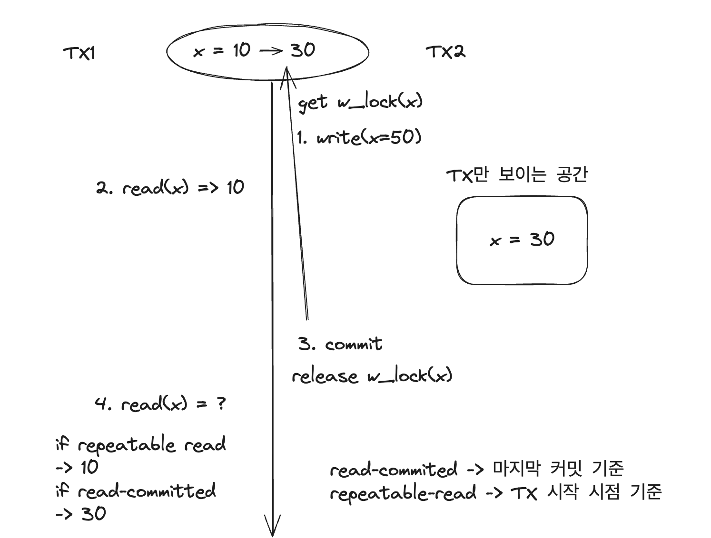
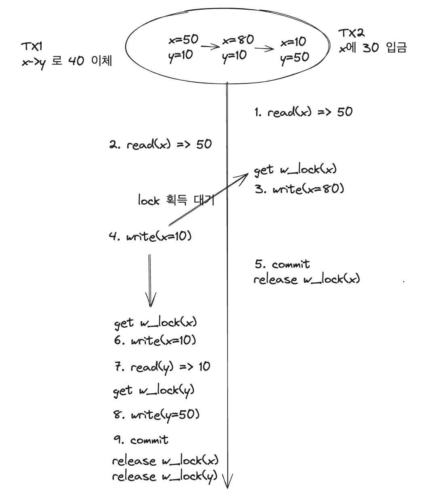
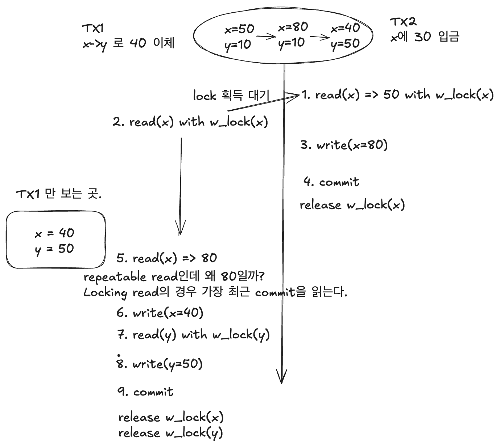
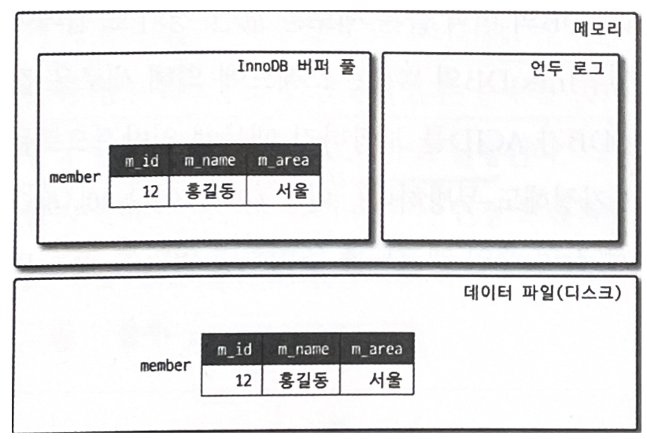
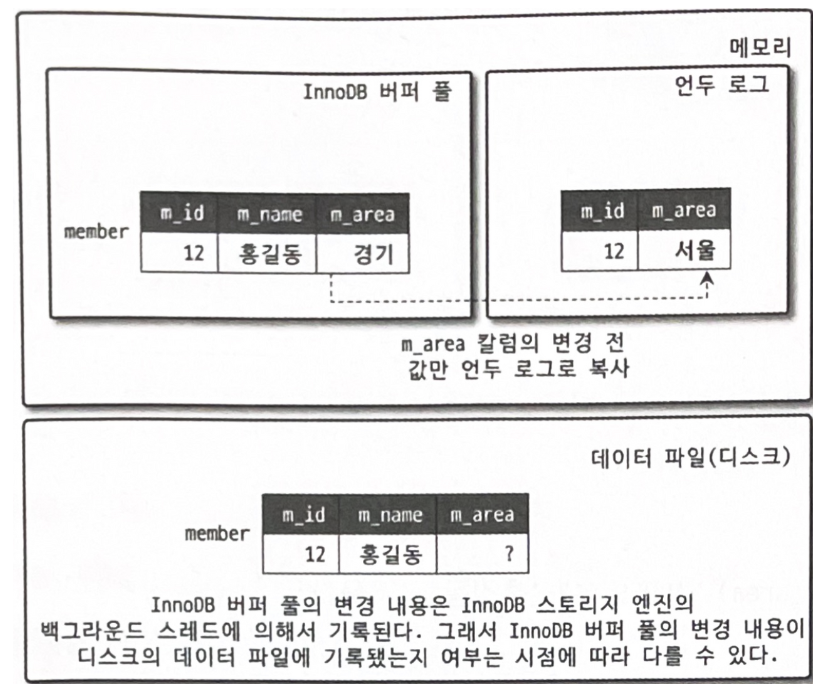

## MVCC (Multi Version Concurrency Control)

진주가 올린 1주차 SELECT FOR UPDATE 관련 내용 + MVCC 보충 설명

### MVCC 성능

MVCC가 이전의 Lock-base로 동작할때는 읽기 연산끼리만 동시 처리가 가능하고 나머지는 모두 불가능했다. 때문에 TPS가 낮았고 이를 해결하기 위해서 대부분의 RDBMS가 MVCC 기능을 사용하고 있다.


### 정의

> MVCC는 동시 접근을 허용하는 데이터베이스에서 동시성을 제어하기 위해 사용하는 방법 중 하나이다.
> MVCC는 원본의 데이터와 변경중인 데이터를 동시에 유지하는 방식으로, 원본 데이터에 대한 Snapshot을 백업하여 보관한다. 만약 두 가지 버전의 데이터가 존재하는 상황에서 새로운 사용자가 데이터에 접근하면 데이터베이스의 Snapshot을 읽는다. 그러다가 변경이 취소되면 원본 Snapshot을 바탕으로 데이터를 복구하고, 만약 변경이 완료되면 최종적으로 디스크에 반영하는 방식으로 동작한다.
> 결국 MVCC는 스냅샷을 이용하는 방식으로, 기존의 데이터를 덮어 씌우는게 아니라 기존의 데이터를 바탕으로 이전 버전의 데이터와 비교해서 변경된 내용을 기록한다. 이렇게 해서 하나의 데이터에 대해 여러 버전의 데이터가 존재하게 되고, 사용자는 마지막 버전의 데이터를 읽게 된다. 이러한 구조를 지닌 MVCC의 특징을 정리하면 아래와 같다.
>
> 일반적인 RDBMS보다 매우 빠르게 작동
> 사용하지 않는 데이터가 계속 쌓이게 되므로 데이터를 정리하는 시스템이 필요
> 데이터 버전이 충돌하면 애플리케이션 영역에서 이러한 문제를 해결해야 함
>
> 출처: [https://mangkyu.tistory.com/53](https://mangkyu.tistory.com/53) [MangKyu's Diary:티스토리]


### 핵심 기능

MVCC의 가장 핵심적인 기능은 잠금없이 일관된 데이터를 읽을 수 있는 것이다.

 **특정 시점**을 기준으로 가장 최근에 **Commit된 데이터**를 읽는다.

* 여기서의 특정 시점은 격리 수준에 따라서 달라진다. 이는 아래서 예제를 보자.


### MVCC 동작 흐름

간단한 예시로 MVCC 동작을 이해해보자.



TX1과 TX2가 있고 1, 2, 3, 4 순으로 연산을 실행한다고 가정하자.

1. TX2에서 x=30으로 값을 변경하려고 한다. 그런데 write를 위해서는 쓰기락을 얻어야 하는데 다른 TX에서 X에 대한 쓰기락을 가지고 있는 곳이 없기 때문에 바로 락을 획득하고 값을 쓴다. 이때 TX2만 볼 수 있는 곳에 값을 쓴다.
2. TX1에서 x에 대한 읽기를 수행한다. read-committed 이상의 격리 수준에서는 변경되기 전의 10이 읽힌다.
3. TX2에서 커밋을 수행하고 쓰기락을 반납한다. 그러면 이 데이터는 DB에 영구 반영된다.
4. TX1에서 x를 읽으면 어떤 값이 나올까?
   * repeatable-read 수준에서는 10이 읽힌다.
   * read-committed 수준에서는 30이 읽힌다.


### Repeatable Read

**해당 격리 수준에서는 트랜잭션을 시작한 시점의 데이터를 읽게 된다.** 즉 2번 시점에는 x의 값이 변경되기 전이므로 10이 반환된다.

-> 여기서 트랜잭션 시작 시점은 RDBMS마다 약간씩 차이가 있다.

1. 트랜잭션 시작 시점 (MySQL)
2. 트랜잭션 안에서 최초의 읽기가 발생한 시점
3. 트랜잭션 안에서 최초의 읽기 또는 쓰기가 발생한 시점


### Read Committed

**해당 격리 수준에서는 읽는 시점을 기준으로 가장 최근에 커밋된 데이터를 읽는다.** 즉 4번 시점 이전 기준으로 가장 최신 커밋은 3이므로 x=30이 읽힌다

### 

### Read uncommitted

MVCC는 커밋된 데이터를 읽기 때문에 해당 격리 수준에서는 MVCC가 동작하지 않는다.


### Serializable

MVCC로 동작하기 보다는 Lock-based로 동작한다. Repeatable Read와 유사하지만 내부적으로 평범한 SELECT도 읽기락을 함께 획득해서 가져온다.  

때문에 데드락이 발생하는 경우가 많다.

### 

### 주의점

MySQL에서 Repeatable read 격리 수준으로 설정하고 MVCC로 동작할 때, **Lost-Update**가 발생할 수 있다. 아래 사례를 보자.



1. TX2에서 x를 읽는다. (x=50)
2. TX1에서 x를 읽는다. (x=50)
3. TX2에서 x에 대한 쓰기락을 획득하고 x=80으로 쓴다.
4. TX1에서 x에 10을 쓰려고 하는데 TX2에서 락을 가지고 있으므로 블로킹되고 대기한다.
5. TX2에서 커밋하고 x에 대한 락을 해지한다.
6. 블로킹 상태의 TX1이 쓰기락을 획득하고 x=10으로 쓴다. (이전 TX2에서 쓴 값이 손실된다.)
7. TX1에서 y륵 읽는다. (y=10)
8. TX1에서 y에 대한 쓰기락을 획득하고 y=50으로 쓴다.
9. TX1에서 커밋하고 x, y에 대한 락을 해지한다.

원래 결과는 x=40, y=50이 나와야 하는데 TX2의 업데이트 내용이 분실되어 x=10, y=50이라는 결과가 나왔다. 이를 **Lost Update**라고 한다.


### 해결

그럼 이 문제를 어떻게 해결할 수 있을까? MySQL에서는 **SELECT FOR UPDATE**를 사용하여 이 문제를 해결할 수 있다. SELECT FOR UPDATE를 사용하면 읽는 시점에 쓰기락을 가져오게 된다. 아래 예시를 보자.



위와 차이점은 데이터를 읽는 시점에 쓰기락을 획득한다는 점이다.

주의해서 봐야할 부분은 5번이다. Repeatable read는 TX 시작 시점의 가장 최근 커밋을 읽는다고 했는데 왜 값이 50이 아니라 80일까?

**특수하게 Locking Read를 하는 경우에만 TX 시작 시점이 아닌 가장 최근 커밋을 기준으로 읽게 된다.** 여기서는 TX2에서 커밋한 x=80의 결과가 읽힌다.


### 언두 로그 (Undo Log) 활용

MySQL의 경우 MVCC를 구현하기 위해 언두 로그를 활용한다. Read committed 수준에서 예시를 살펴보자.


```SQL
INSERT INTO member(m_id, m_name, m_area) VALUES (12, "홍길동", "서울");
```

위 쿼리가 실행되면 데이터베이스 메모리(버퍼풀)과 디스크에 각각 데이터가 저장된다.




그리고 아래와 같이 UPDATE 쿼리를 실행해서 데이터를 갱신해보자.

```SQL
START TRANSACTION;
UPDATE member SET m_area = "경기" WHERE m_id = 12;
```



UPDATE가 실행되면 커밋 여부와 관계없이 바로 버퍼풀의 값을 갱신하고 언두 로그에 변경하기 이전의 데이터를 복사해서 넣는다. 디스크의 값은 백그라운드 스레드에 의해서 처리되므로 정확한 변경 시점은 알 수 없지만 MySQL은 ACID를 보장하기 때문에 버퍼풀과 디스크의 상태는 동일하다고 가정해도 된다.

이 상태에서 아래와 같은 SELECT 쿼리를 날리면 어떤 값이 조회될까?

```SQL
SELECT* FROM member WHERE m_id=12;
```

이는 격리 수준마다 다른 값이 조회되는데 Read committed의 경우 Undo 영역의 값을 조회하게 된다. 

* Read committed 이상의 격리 수준에서는 undo에서 조회 
* Read uncommitted의 경우 버퍼풀에서 조회 

MySQL은 위와 같이 언두 로그를 활용해서 MVCC를 제공하고 Serializable 격리 수준을 제외한 모든 격리 수준에서 **잠금 없는 일관된 읽기**를 제공한다.


### 참고 자료

* Real MySQL
* [https://mangkyu.tistory.com/288](https://mangkyu.tistory.com/288)
* [https://www.youtube.com/watch?v=wiVvVanI3p4](https://www.youtube.com/watch?v=wiVvVanI3p4)

